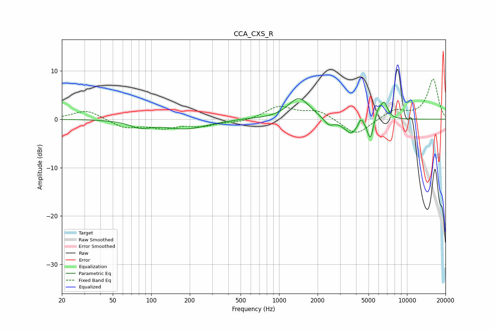

# CCA_CXS_R
See [usage instructions](https://github.com/jaakkopasanen/AutoEq#usage) for more options and info.

### Parametric EQs
Apply preamp of -4.3 dB when using parametric equalizer.

|   # | Type    |   Fc (Hz) |    Q |   Gain (dB) |
|-----|---------|-----------|------|-------------|
|   1 | Peaking |        82 | 1.7  |        -1.4 |
|   2 | Peaking |       186 | 0.85 |        -1.9 |
|   3 | Peaking |       527 | 1.57 |         0.1 |
|   4 | Peaking |      1428 | 1.71 |         4.5 |
|   5 | Peaking |      2447 | 3.76 |        -1.5 |
|   6 | Peaking |      3688 | 2.41 |        -3.2 |
|   7 | Peaking |      4366 | 6    |         2   |
|   8 | Peaking |      5165 | 5.99 |        -4.2 |
|   9 | Peaking |      5938 | 6    |         1.8 |
|  10 | Peaking |      6620 | 4.77 |         3.5 |

### Fixed Band EQs
When using fixed band (also called graphic) equalizer, apply preamp of **-8.4 dB** (if available) and set gains manually with these parameters.

|   # | Type    |   Fc (Hz) |    Q |   Gain (dB) |
|-----|---------|-----------|------|-------------|
|   1 | Peaking |        31 | 1.41 |         2   |
|   2 | Peaking |        62 | 1.41 |        -1.8 |
|   3 | Peaking |       125 | 1.41 |        -1.6 |
|   4 | Peaking |       250 | 1.41 |        -1.2 |
|   5 | Peaking |       500 | 1.41 |        -0.6 |
|   6 | Peaking |      1000 | 1.41 |         2.6 |
|   7 | Peaking |      2000 | 1.41 |         1.7 |
|   8 | Peaking |      4000 | 1.41 |        -3.4 |
|   9 | Peaking |      8000 | 1.41 |         1.9 |
|  10 | Peaking |     16000 | 1.41 |         8.3 |

### Graphs

