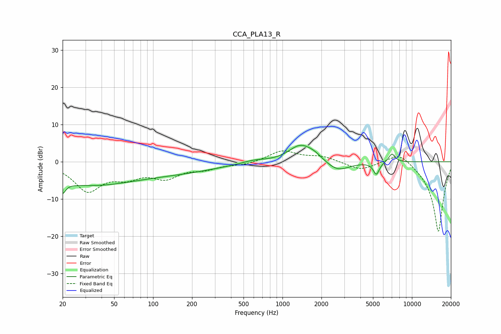

# CCA_PLA13_R
See [usage instructions](https://github.com/jaakkopasanen/AutoEq#usage) for more options and info.

### Parametric EQs
Apply preamp of -4.5 dB when using parametric equalizer.

|   # | Type    |   Fc (Hz) |    Q |   Gain (dB) |
|-----|---------|-----------|------|-------------|
|   1 | Peaking |        20 | 5.89 |        -6.3 |
|   2 | Peaking |        20 | 5.81 |         3.4 |
|   3 | Peaking |        31 | 0.35 |        -6   |
|   4 | Peaking |       176 | 0.47 |        -2   |
|   5 | Peaking |       599 | 1.6  |         0.8 |
|   6 | Peaking |      1369 | 1.58 |         4.4 |
|   7 | Peaking |      1756 | 2.29 |         1.3 |
|   8 | Peaking |      2667 | 1.59 |        -2.7 |
|   9 | Peaking |      5307 | 6    |        -3.3 |
|  10 | Peaking |      7000 | 5.34 |         2.4 |

### Fixed Band EQs
When using fixed band (also called graphic) equalizer, apply preamp of **-3.0 dB** (if available) and set gains manually with these parameters.

|   # | Type    |   Fc (Hz) |    Q |   Gain (dB) |
|-----|---------|-----------|------|-------------|
|   1 | Peaking |        31 | 1.41 |        -7.5 |
|   2 | Peaking |        62 | 1.41 |        -3.2 |
|   3 | Peaking |       125 | 1.41 |        -3.8 |
|   4 | Peaking |       250 | 1.41 |        -1.6 |
|   5 | Peaking |       500 | 1.41 |        -0.8 |
|   6 | Peaking |      1000 | 1.41 |         3   |
|   7 | Peaking |      2000 | 1.41 |         1.4 |
|   8 | Peaking |      4000 | 1.41 |        -2.2 |
|   9 | Peaking |      8000 | 1.41 |         3.2 |
|  10 | Peaking |     16000 | 1.41 |       -19   |

### Graphs

