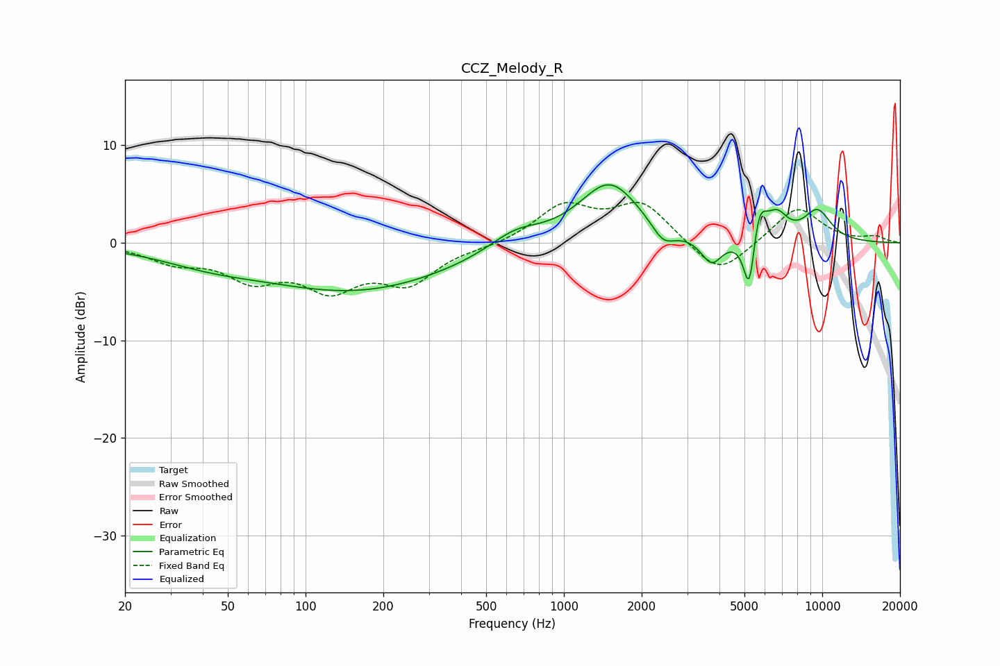

# CCZ_Melody_R
See [usage instructions](https://github.com/jaakkopasanen/AutoEq#usage) for more options and info.

### Parametric EQs
Apply preamp of -6.0 dB when using parametric equalizer.

|   # | Type    |   Fc (Hz) |    Q |   Gain (dB) |
|-----|---------|-----------|------|-------------|
|   1 | Peaking |        42 | 0.7  |        -1.3 |
|   2 | Peaking |       158 | 0.38 |        -4.8 |
|   3 | Peaking |       648 | 1.38 |         1.8 |
|   4 | Peaking |      1501 | 1.19 |         6.3 |
|   5 | Peaking |      2425 | 3.07 |        -1.9 |
|   6 | Peaking |      3731 | 3.37 |        -2.7 |
|   7 | Peaking |      5228 | 6    |        -6.7 |
|   8 | Peaking |      5671 | 4.68 |         4.1 |
|   9 | Peaking |      6689 | 3.29 |         2.3 |
|  10 | Peaking |      9579 | 2.27 |         3.1 |

### Fixed Band EQs
When using fixed band (also called graphic) equalizer, apply preamp of **-4.2 dB** (if available) and set gains manually with these parameters.

|   # | Type    |   Fc (Hz) |    Q |   Gain (dB) |
|-----|---------|-----------|------|-------------|
|   1 | Peaking |        31 | 1.41 |        -1.7 |
|   2 | Peaking |        62 | 1.41 |        -3.3 |
|   3 | Peaking |       125 | 1.41 |        -4.1 |
|   4 | Peaking |       250 | 1.41 |        -3.8 |
|   5 | Peaking |       500 | 1.41 |        -0.3 |
|   6 | Peaking |      1000 | 1.41 |         3.7 |
|   7 | Peaking |      2000 | 1.41 |         4   |
|   8 | Peaking |      4000 | 1.41 |        -3.6 |
|   9 | Peaking |      8000 | 1.41 |         3.7 |
|  10 | Peaking |     16000 | 1.41 |         0.6 |

### Graphs

