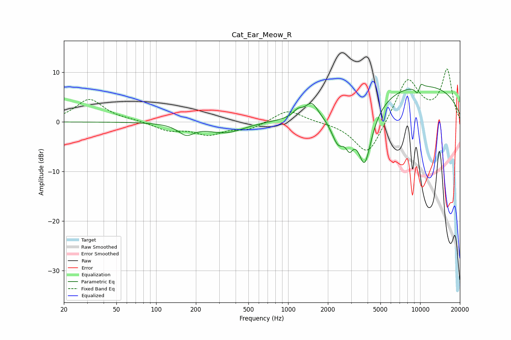

# Cat_Ear_Meow_R
See [usage instructions](https://github.com/jaakkopasanen/AutoEq#usage) for more options and info.

### Parametric EQs
Apply preamp of -7.7 dB when using parametric equalizer.

|   # | Type    |   Fc (Hz) |    Q |   Gain (dB) |
|-----|---------|-----------|------|-------------|
|   1 | Peaking |       169 | 2.34 |        -2.1 |
|   2 | Peaking |       337 | 1.03 |        -2.1 |
|   3 | Peaking |      1186 | 4.03 |         1.3 |
|   4 | Peaking |      1507 | 3.08 |         2.9 |
|   5 | Peaking |      2393 | 2.63 |        -5.8 |
|   6 | Peaking |      2917 | 5.02 |        -3.4 |
|   7 | Peaking |      3800 | 2.39 |       -12.7 |
|   8 | Peaking |      9271 | 0.23 |         7.6 |
|   9 | Peaking |      9635 | 5.98 |        -2.4 |
|  10 | Peaking |     10000 | 6    |         1.9 |

### Fixed Band EQs
When using fixed band (also called graphic) equalizer, apply preamp of **-10.8 dB** (if available) and set gains manually with these parameters.

|   # | Type    |   Fc (Hz) |    Q |   Gain (dB) |
|-----|---------|-----------|------|-------------|
|   1 | Peaking |        31 | 1.41 |         4.6 |
|   2 | Peaking |        62 | 1.41 |         0.3 |
|   3 | Peaking |       125 | 1.41 |        -1.6 |
|   4 | Peaking |       250 | 1.41 |        -2.3 |
|   5 | Peaking |       500 | 1.41 |        -1.4 |
|   6 | Peaking |      1000 | 1.41 |         2.6 |
|   7 | Peaking |      2000 | 1.41 |        -0   |
|   8 | Peaking |      4000 | 1.41 |        -7.2 |
|   9 | Peaking |      8000 | 1.41 |         9   |
|  10 | Peaking |     16000 | 1.41 |        10.3 |

### Graphs

