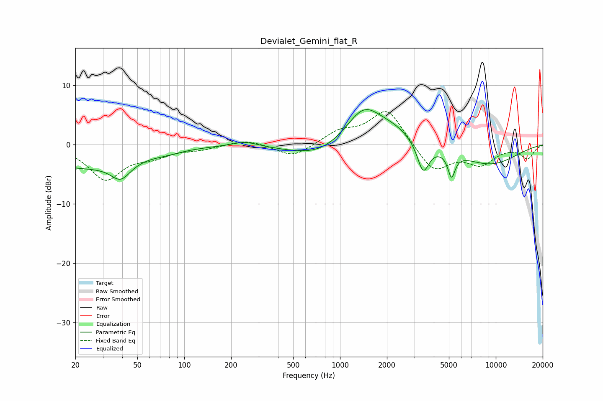

# Devialet_Gemini_flat_R
See [usage instructions](https://github.com/jaakkopasanen/AutoEq#usage) for more options and info.

### Parametric EQs
Apply preamp of -6.0 dB when using parametric equalizer.

|   # | Type    |   Fc (Hz) |    Q |   Gain (dB) |
|-----|---------|-----------|------|-------------|
|   1 | Peaking |        22 | 0.43 |        -3.7 |
|   2 | Peaking |        39 | 2.28 |        -2.9 |
|   3 | Peaking |        78 | 1.59 |        -0.4 |
|   4 | Peaking |       245 | 1.66 |         0.9 |
|   5 | Peaking |       757 | 0.72 |        -2.5 |
|   6 | Peaking |      1419 | 1.15 |         6.7 |
|   7 | Peaking |      2277 | 1.22 |         1.7 |
|   8 | Peaking |      3417 | 3.75 |        -5.1 |
|   9 | Peaking |      5195 | 6    |        -4   |
|  10 | Peaking |      9120 | 0.66 |        -3.3 |

### Fixed Band EQs
When using fixed band (also called graphic) equalizer, apply preamp of **-5.7 dB** (if available) and set gains manually with these parameters.

|   # | Type    |   Fc (Hz) |    Q |   Gain (dB) |
|-----|---------|-----------|------|-------------|
|   1 | Peaking |        31 | 1.41 |        -5.7 |
|   2 | Peaking |        62 | 1.41 |        -1.6 |
|   3 | Peaking |       125 | 1.41 |        -0.7 |
|   4 | Peaking |       250 | 1.41 |         0.9 |
|   5 | Peaking |       500 | 1.41 |        -2.2 |
|   6 | Peaking |      1000 | 1.41 |         2   |
|   7 | Peaking |      2000 | 1.41 |         6.1 |
|   8 | Peaking |      4000 | 1.41 |        -4.7 |
|   9 | Peaking |      8000 | 1.41 |        -3.1 |
|  10 | Peaking |     16000 | 1.41 |        -2.2 |

### Graphs

