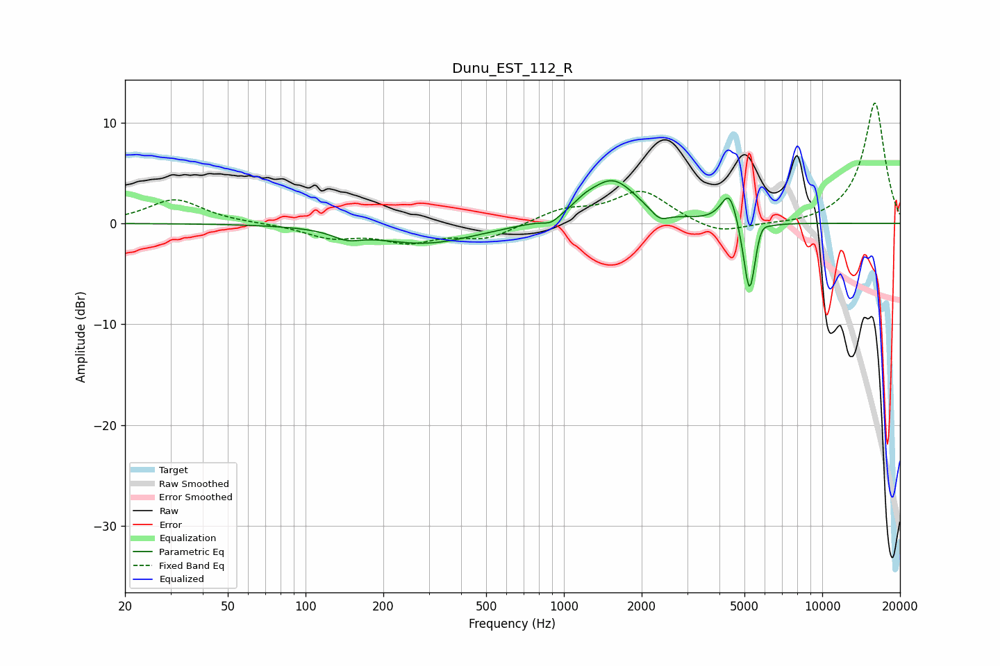

# Dunu_EST_112_R
See [usage instructions](https://github.com/jaakkopasanen/AutoEq#usage) for more options and info.

### Parametric EQs
Apply preamp of -4.3 dB when using parametric equalizer.

|   # | Type    |   Fc (Hz) |    Q |   Gain (dB) |
|-----|---------|-----------|------|-------------|
|   1 | Peaking |       144 | 2.62 |        -0.8 |
|   2 | Peaking |       290 | 0.71 |        -2   |
|   3 | Peaking |       891 | 4.38 |        -0.7 |
|   4 | Peaking |      1200 | 3.53 |         0.5 |
|   5 | Peaking |      1538 | 1.48 |         4.3 |
|   6 | Peaking |      2347 | 4.01 |        -1   |
|   7 | Peaking |      4373 | 4.36 |         3.4 |
|   8 | Peaking |      5206 | 6    |        -1.1 |
|   9 | Peaking |      5235 | 6    |        -6.7 |
|  10 | Peaking |      5779 | 5.99 |         1.2 |

### Fixed Band EQs
When using fixed band (also called graphic) equalizer, apply preamp of **-12.0 dB** (if available) and set gains manually with these parameters.

|   # | Type    |   Fc (Hz) |    Q |   Gain (dB) |
|-----|---------|-----------|------|-------------|
|   1 | Peaking |        31 | 1.41 |         2.4 |
|   2 | Peaking |        62 | 1.41 |         0   |
|   3 | Peaking |       125 | 1.41 |        -1.3 |
|   4 | Peaking |       250 | 1.41 |        -1.6 |
|   5 | Peaking |       500 | 1.41 |        -1.4 |
|   6 | Peaking |      1000 | 1.41 |         1.3 |
|   7 | Peaking |      2000 | 1.41 |         3.2 |
|   8 | Peaking |      4000 | 1.41 |        -1.2 |
|   9 | Peaking |      8000 | 1.41 |        -0.2 |
|  10 | Peaking |     16000 | 1.41 |        12   |

### Graphs

