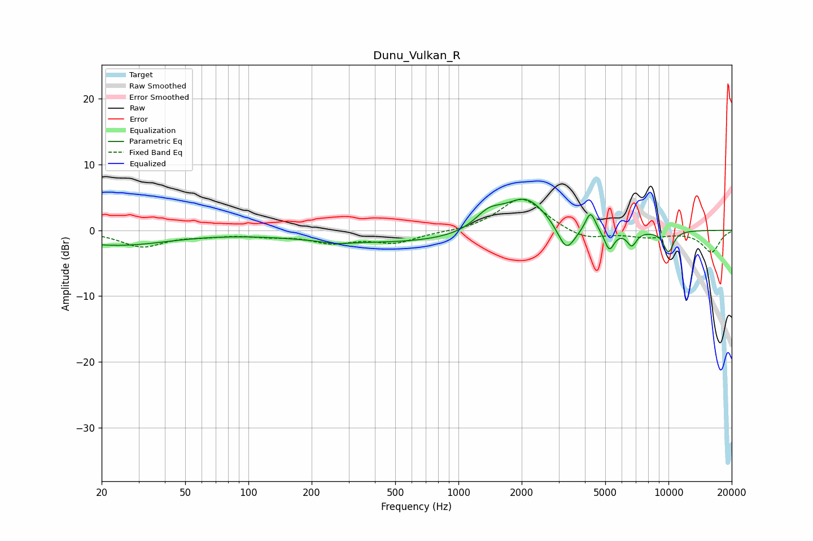

# Dunu_Vulkan_R
See [usage instructions](https://github.com/jaakkopasanen/AutoEq#usage) for more options and info.

### Parametric EQs
Apply preamp of -4.8 dB when using parametric equalizer.

|   # | Type    |   Fc (Hz) |    Q |   Gain (dB) |
|-----|---------|-----------|------|-------------|
|   1 | Peaking |        23 | 0.55 |        -2.2 |
|   2 | Peaking |       262 | 2.25 |        -0.4 |
|   3 | Peaking |       561 | 0.27 |        -2   |
|   4 | Peaking |      1391 | 2.07 |         2.5 |
|   5 | Peaking |      2093 | 1.31 |         5.5 |
|   6 | Peaking |      3263 | 3.34 |        -4.2 |
|   7 | Peaking |      4254 | 5.96 |         3   |
|   8 | Peaking |      5232 | 6    |        -3.1 |
|   9 | Peaking |      6686 | 6    |        -2.2 |
|  10 | Peaking |     10000 | 4.94 |        -3.3 |

### Fixed Band EQs
When using fixed band (also called graphic) equalizer, apply preamp of **-4.8 dB** (if available) and set gains manually with these parameters.

|   # | Type    |   Fc (Hz) |    Q |   Gain (dB) |
|-----|---------|-----------|------|-------------|
|   1 | Peaking |        31 | 1.41 |        -2.4 |
|   2 | Peaking |        62 | 1.41 |        -0.6 |
|   3 | Peaking |       125 | 1.41 |        -0.6 |
|   4 | Peaking |       250 | 1.41 |        -1.7 |
|   5 | Peaking |       500 | 1.41 |        -1.8 |
|   6 | Peaking |      1000 | 1.41 |        -0.2 |
|   7 | Peaking |      2000 | 1.41 |         5.1 |
|   8 | Peaking |      4000 | 1.41 |        -1.6 |
|   9 | Peaking |      8000 | 1.41 |        -0.9 |
|  10 | Peaking |     16000 | 1.41 |        -3.3 |

### Graphs

