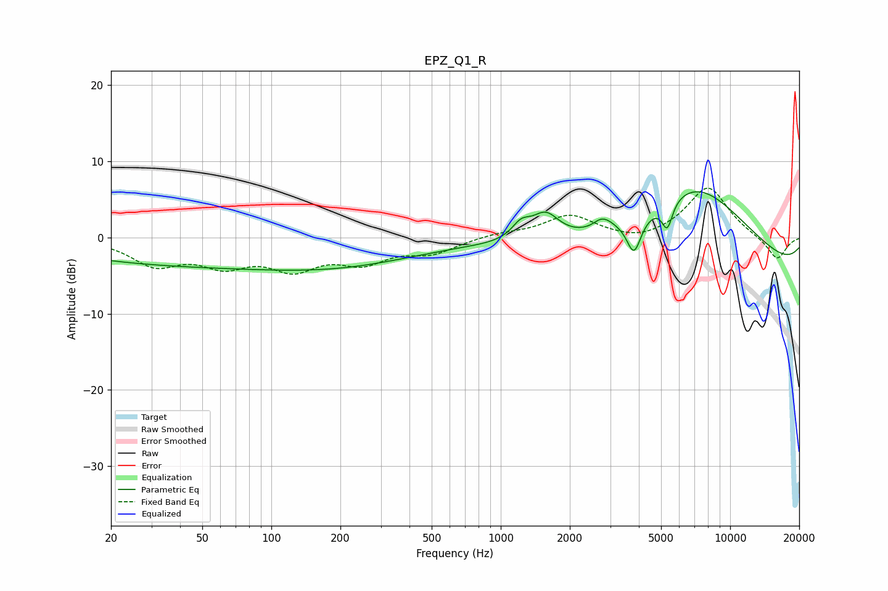

# EPZ_Q1_R
See [usage instructions](https://github.com/jaakkopasanen/AutoEq#usage) for more options and info.

### Parametric EQs
Apply preamp of -6.1 dB when using parametric equalizer.

|   # | Type    |   Fc (Hz) |    Q |   Gain (dB) |
|-----|---------|-----------|------|-------------|
|   1 | Peaking |        47 | 0.31 |         1.8 |
|   2 | Peaking |        68 | 0.18 |        -5.8 |
|   3 | Peaking |      1227 | 3.54 |         1.9 |
|   4 | Peaking |      1567 | 2.35 |         3.5 |
|   5 | Peaking |      2686 | 4.99 |         0.4 |
|   6 | Peaking |      2844 | 3.31 |         1.2 |
|   7 | Peaking |      3810 | 4.5  |        -4.7 |
|   8 | Peaking |      5319 | 6    |        -3.6 |
|   9 | Peaking |      7032 | 0.47 |        13   |
|  10 | Peaking |      8782 | 0.18 |        -6.7 |

### Fixed Band EQs
When using fixed band (also called graphic) equalizer, apply preamp of **-6.6 dB** (if available) and set gains manually with these parameters.

|   # | Type    |   Fc (Hz) |    Q |   Gain (dB) |
|-----|---------|-----------|------|-------------|
|   1 | Peaking |        31 | 1.41 |        -3.3 |
|   2 | Peaking |        62 | 1.41 |        -3.1 |
|   3 | Peaking |       125 | 1.41 |        -3.6 |
|   4 | Peaking |       250 | 1.41 |        -2.8 |
|   5 | Peaking |       500 | 1.41 |        -1.8 |
|   6 | Peaking |      1000 | 1.41 |         0.5 |
|   7 | Peaking |      2000 | 1.41 |         2.9 |
|   8 | Peaking |      4000 | 1.41 |        -0.8 |
|   9 | Peaking |      8000 | 1.41 |         6.7 |
|  10 | Peaking |     16000 | 1.41 |        -3   |

### Graphs

