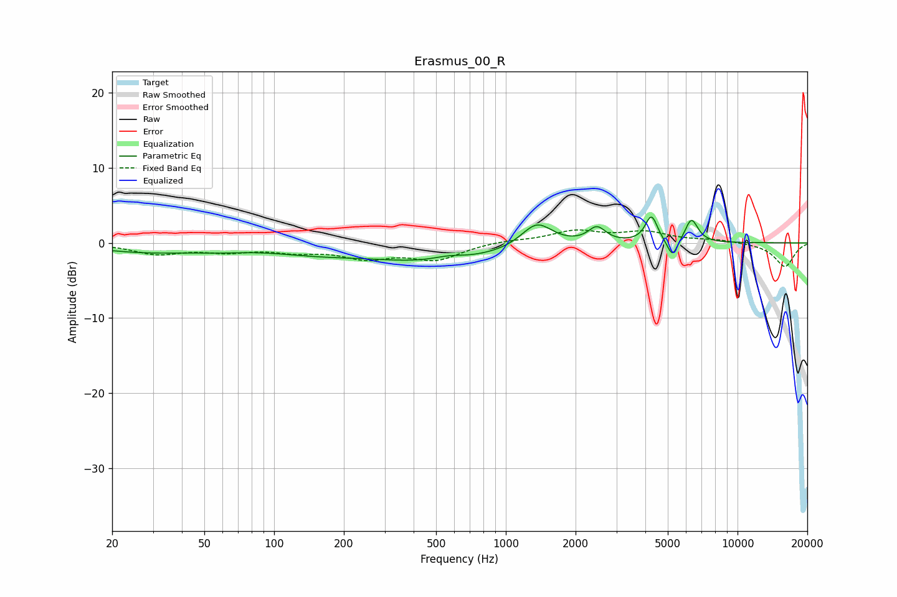

# Erasmus_00_R
See [usage instructions](https://github.com/jaakkopasanen/AutoEq#usage) for more options and info.

### Parametric EQs
Apply preamp of -3.5 dB when using parametric equalizer.

|   # | Type    |   Fc (Hz) |    Q |   Gain (dB) |
|-----|---------|-----------|------|-------------|
|   1 | Peaking |        28 | 0.62 |        -1.2 |
|   2 | Peaking |        58 | 1.25 |        -0.4 |
|   3 | Peaking |       148 | 0.71 |        -0.9 |
|   4 | Peaking |       501 | 0.48 |        -2.4 |
|   5 | Peaking |       565 | 2.04 |         0.6 |
|   6 | Peaking |      1361 | 2.09 |         3.3 |
|   7 | Peaking |      2472 | 3.73 |         2   |
|   8 | Peaking |      4251 | 5.38 |         3.5 |
|   9 | Peaking |      5243 | 6    |        -2.4 |
|  10 | Peaking |      6324 | 4.93 |         3.2 |

### Fixed Band EQs
When using fixed band (also called graphic) equalizer, apply preamp of **-1.8 dB** (if available) and set gains manually with these parameters.

|   # | Type    |   Fc (Hz) |    Q |   Gain (dB) |
|-----|---------|-----------|------|-------------|
|   1 | Peaking |        31 | 1.41 |        -1.4 |
|   2 | Peaking |        62 | 1.41 |        -1   |
|   3 | Peaking |       125 | 1.41 |        -0.9 |
|   4 | Peaking |       250 | 1.41 |        -1.8 |
|   5 | Peaking |       500 | 1.41 |        -2.1 |
|   6 | Peaking |      1000 | 1.41 |         0.3 |
|   7 | Peaking |      2000 | 1.41 |         1.5 |
|   8 | Peaking |      4000 | 1.41 |         1.3 |
|   9 | Peaking |      8000 | 1.41 |         0.4 |
|  10 | Peaking |     16000 | 1.41 |        -3.2 |

### Graphs

