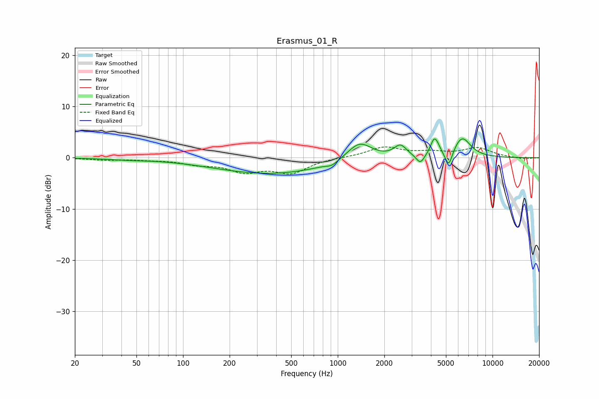

# Erasmus_01_R
See [usage instructions](https://github.com/jaakkopasanen/AutoEq#usage) for more options and info.

### Parametric EQs
Apply preamp of -3.8 dB when using parametric equalizer.

|   # | Type    |   Fc (Hz) |    Q |   Gain (dB) |
|-----|---------|-----------|------|-------------|
|   1 | Peaking |        43 | 1.13 |        -0.3 |
|   2 | Peaking |       371 | 0.38 |        -3.1 |
|   3 | Peaking |       916 | 4    |        -0.7 |
|   4 | Peaking |      1381 | 1.76 |         3.7 |
|   5 | Peaking |      2538 | 3.46 |         2.3 |
|   6 | Peaking |      3413 | 5.36 |        -1.8 |
|   7 | Peaking |      4191 | 5.9  |         2.9 |
|   8 | Peaking |      4420 | 5.97 |         0.9 |
|   9 | Peaking |      5217 | 6    |        -3.3 |
|  10 | Peaking |      6355 | 2.5  |         4   |

### Fixed Band EQs
When using fixed band (also called graphic) equalizer, apply preamp of **-2.2 dB** (if available) and set gains manually with these parameters.

|   # | Type    |   Fc (Hz) |    Q |   Gain (dB) |
|-----|---------|-----------|------|-------------|
|   1 | Peaking |        31 | 1.41 |        -0.4 |
|   2 | Peaking |        62 | 1.41 |        -0.3 |
|   3 | Peaking |       125 | 1.41 |        -1   |
|   4 | Peaking |       250 | 1.41 |        -2.4 |
|   5 | Peaking |       500 | 1.41 |        -2.8 |
|   6 | Peaking |      1000 | 1.41 |         0.1 |
|   7 | Peaking |      2000 | 1.41 |         2   |
|   8 | Peaking |      4000 | 1.41 |         0.9 |
|   9 | Peaking |      8000 | 1.41 |         1.8 |
|  10 | Peaking |     16000 | 1.41 |        -0.3 |

### Graphs

