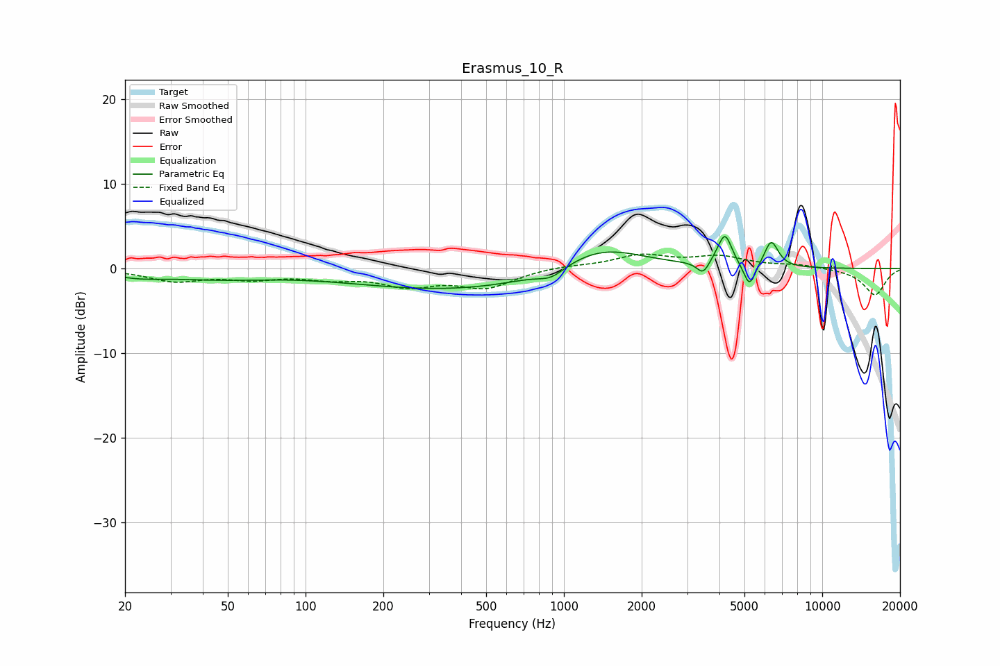

# Erasmus_10_R
See [usage instructions](https://github.com/jaakkopasanen/AutoEq#usage) for more options and info.

### Parametric EQs
Apply preamp of -3.9 dB when using parametric equalizer.

|   # | Type    |   Fc (Hz) |    Q |   Gain (dB) |
|-----|---------|-----------|------|-------------|
|   1 | Peaking |        22 | 1.42 |        -0.6 |
|   2 | Peaking |        45 | 0.65 |        -1   |
|   3 | Peaking |       405 | 0.33 |        -2.6 |
|   4 | Peaking |       893 | 2.77 |        -1.1 |
|   5 | Peaking |      1383 | 0.83 |         3.2 |
|   6 | Peaking |      3459 | 5.93 |        -1.6 |
|   7 | Peaking |      4136 | 3.59 |         1.4 |
|   8 | Peaking |      4212 | 5.99 |         2.5 |
|   9 | Peaking |      5229 | 6    |        -2.9 |
|  10 | Peaking |      6347 | 5.04 |         3.2 |

### Fixed Band EQs
When using fixed band (also called graphic) equalizer, apply preamp of **-1.8 dB** (if available) and set gains manually with these parameters.

|   # | Type    |   Fc (Hz) |    Q |   Gain (dB) |
|-----|---------|-----------|------|-------------|
|   1 | Peaking |        31 | 1.41 |        -1.4 |
|   2 | Peaking |        62 | 1.41 |        -1   |
|   3 | Peaking |       125 | 1.41 |        -0.9 |
|   4 | Peaking |       250 | 1.41 |        -1.8 |
|   5 | Peaking |       500 | 1.41 |        -2.1 |
|   6 | Peaking |      1000 | 1.41 |         0.3 |
|   7 | Peaking |      2000 | 1.41 |         1.5 |
|   8 | Peaking |      4000 | 1.41 |         1.3 |
|   9 | Peaking |      8000 | 1.41 |         0.4 |
|  10 | Peaking |     16000 | 1.41 |        -3.1 |

### Graphs

