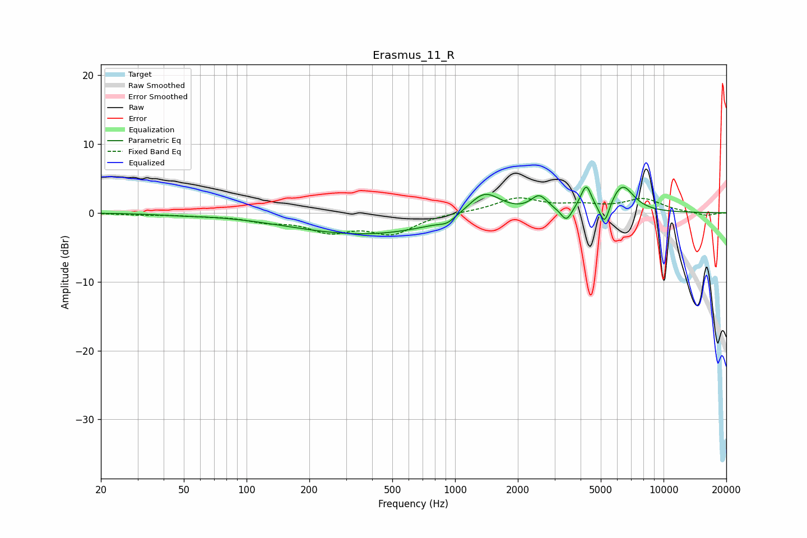

# Erasmus_11_R
See [usage instructions](https://github.com/jaakkopasanen/AutoEq#usage) for more options and info.

### Parametric EQs
Apply preamp of -3.8 dB when using parametric equalizer.

|   # | Type    |   Fc (Hz) |    Q |   Gain (dB) |
|-----|---------|-----------|------|-------------|
|   1 | Peaking |        46 | 1.45 |        -0.2 |
|   2 | Peaking |       374 | 0.39 |        -3.1 |
|   3 | Peaking |       916 | 3.87 |        -0.7 |
|   4 | Peaking |      1382 | 1.77 |         3.7 |
|   5 | Peaking |      2535 | 3.55 |         2.3 |
|   6 | Peaking |      3419 | 5.47 |        -1.9 |
|   7 | Peaking |      4089 | 4.53 |         0.7 |
|   8 | Peaking |      4273 | 5.98 |         3   |
|   9 | Peaking |      5216 | 6    |        -3.3 |
|  10 | Peaking |      6341 | 2.49 |         4   |

### Fixed Band EQs
When using fixed band (also called graphic) equalizer, apply preamp of **-2.3 dB** (if available) and set gains manually with these parameters.

|   # | Type    |   Fc (Hz) |    Q |   Gain (dB) |
|-----|---------|-----------|------|-------------|
|   1 | Peaking |        31 | 1.41 |        -0.2 |
|   2 | Peaking |        62 | 1.41 |        -0.3 |
|   3 | Peaking |       125 | 1.41 |        -1   |
|   4 | Peaking |       250 | 1.41 |        -2.4 |
|   5 | Peaking |       500 | 1.41 |        -2.8 |
|   6 | Peaking |      1000 | 1.41 |         0.1 |
|   7 | Peaking |      2000 | 1.41 |         2.1 |
|   8 | Peaking |      4000 | 1.41 |         0.9 |
|   9 | Peaking |      8000 | 1.41 |         1.9 |
|  10 | Peaking |     16000 | 1.41 |        -0.5 |

### Graphs

