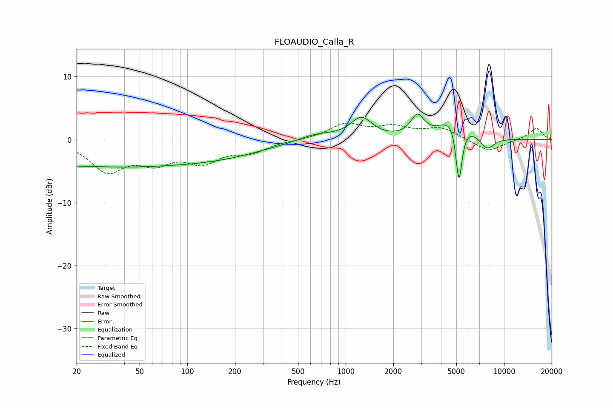

# FLOAUDIO_Calla_R
See [usage instructions](https://github.com/jaakkopasanen/AutoEq#usage) for more options and info.

### Parametric EQs
Apply preamp of -4.2 dB when using parametric equalizer.

|   # | Type    |   Fc (Hz) |    Q |   Gain (dB) |
|-----|---------|-----------|------|-------------|
|   1 | Peaking |        20 | 0.65 |        -2.9 |
|   2 | Peaking |        25 | 1.12 |         0.8 |
|   3 | Peaking |        82 | 0.25 |        -3.8 |
|   4 | Peaking |       316 | 0.84 |         0.2 |
|   5 | Peaking |       651 | 1.13 |         1.2 |
|   6 | Peaking |      1257 | 2.07 |         3.3 |
|   7 | Peaking |      2837 | 3.43 |         3.3 |
|   8 | Peaking |      4982 | 1.88 |         5.3 |
|   9 | Peaking |      5188 | 6    |       -11.2 |
|  10 | Peaking |      7834 | 2.96 |        -2   |

### Fixed Band EQs
When using fixed band (also called graphic) equalizer, apply preamp of **-2.7 dB** (if available) and set gains manually with these parameters.

|   # | Type    |   Fc (Hz) |    Q |   Gain (dB) |
|-----|---------|-----------|------|-------------|
|   1 | Peaking |        31 | 1.41 |        -4.7 |
|   2 | Peaking |        62 | 1.41 |        -3   |
|   3 | Peaking |       125 | 1.41 |        -3.1 |
|   4 | Peaking |       250 | 1.41 |        -1.7 |
|   5 | Peaking |       500 | 1.41 |        -0.1 |
|   6 | Peaking |      1000 | 1.41 |         2.4 |
|   7 | Peaking |      2000 | 1.41 |         1.7 |
|   8 | Peaking |      4000 | 1.41 |         1.8 |
|   9 | Peaking |      8000 | 1.41 |        -1.9 |
|  10 | Peaking |     16000 | 1.41 |         1.9 |

### Graphs

