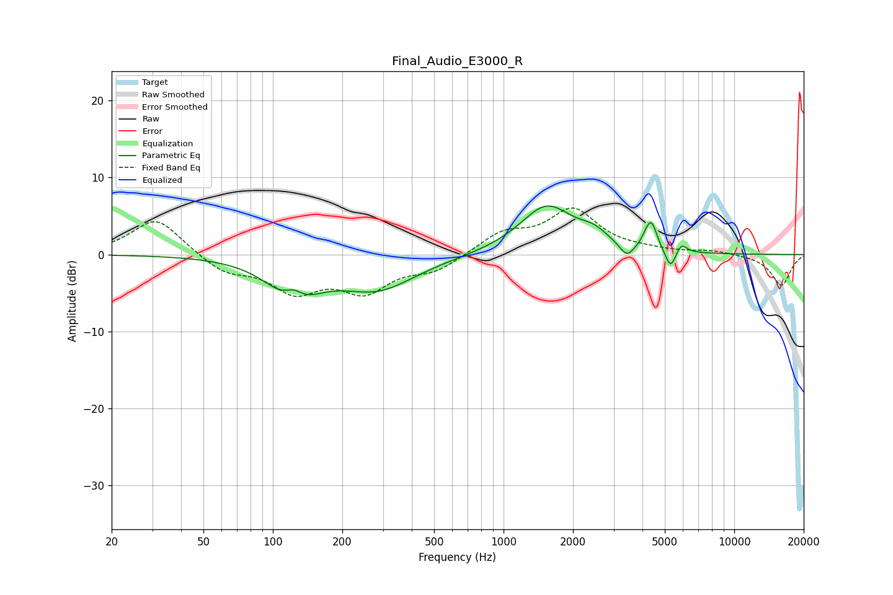

# Final_Audio_E3000_R
See [usage instructions](https://github.com/jaakkopasanen/AutoEq#usage) for more options and info.

### Parametric EQs
Apply preamp of -6.4 dB when using parametric equalizer.

|   # | Type    |   Fc (Hz) |    Q |   Gain (dB) |
|-----|---------|-----------|------|-------------|
|   1 | Peaking |       123 | 1.42 |        -5.8 |
|   2 | Peaking |       123 | 3.16 |         2.4 |
|   3 | Peaking |       284 | 0.84 |        -4.3 |
|   4 | Peaking |      1538 | 1.2  |         6.3 |
|   5 | Peaking |      2462 | 2.25 |         1.5 |
|   6 | Peaking |      3422 | 4.59 |        -1.7 |
|   7 | Peaking |      4176 | 5.99 |         1   |
|   8 | Peaking |      4388 | 5.93 |         3.1 |
|   9 | Peaking |      5304 | 6    |        -2.6 |
|  10 | Peaking |      5884 | 5.99 |         1.4 |

### Fixed Band EQs
When using fixed band (also called graphic) equalizer, apply preamp of **-6.1 dB** (if available) and set gains manually with these parameters.

|   # | Type    |   Fc (Hz) |    Q |   Gain (dB) |
|-----|---------|-----------|------|-------------|
|   1 | Peaking |        31 | 1.41 |         4.8 |
|   2 | Peaking |        62 | 1.41 |        -2.2 |
|   3 | Peaking |       125 | 1.41 |        -4.4 |
|   4 | Peaking |       250 | 1.41 |        -4.3 |
|   5 | Peaking |       500 | 1.41 |        -1.9 |
|   6 | Peaking |      1000 | 1.41 |         2.6 |
|   7 | Peaking |      2000 | 1.41 |         5.6 |
|   8 | Peaking |      4000 | 1.41 |         0.4 |
|   9 | Peaking |      8000 | 1.41 |         0.5 |
|  10 | Peaking |     16000 | 1.41 |        -4   |

### Graphs

