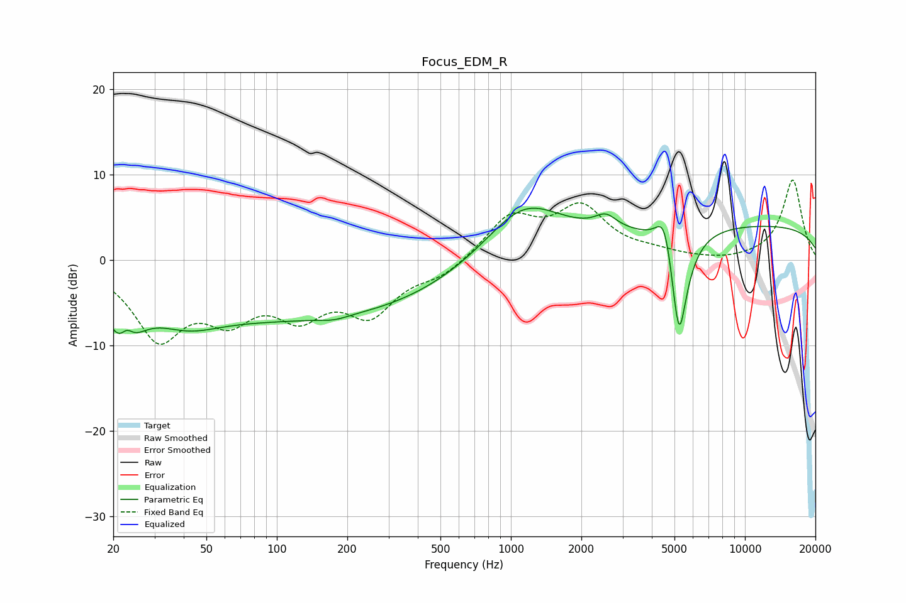

# Focus_EDM_R
See [usage instructions](https://github.com/jaakkopasanen/AutoEq#usage) for more options and info.

### Parametric EQs
Apply preamp of -6.2 dB when using parametric equalizer.

|   # | Type    |   Fc (Hz) |    Q |   Gain (dB) |
|-----|---------|-----------|------|-------------|
|   1 | Peaking |        22 | 2.17 |        -7.2 |
|   2 | Peaking |        23 | 4.77 |         2.8 |
|   3 | Peaking |        41 | 1.01 |        -2.5 |
|   4 | Peaking |       130 | 0.21 |        -6.8 |
|   5 | Peaking |       175 | 2.49 |        -0.4 |
|   6 | Peaking |      1130 | 0.82 |         6.7 |
|   7 | Peaking |      2543 | 3.12 |         1.6 |
|   8 | Peaking |      4539 | 3.84 |         5.1 |
|   9 | Peaking |      5226 | 3.7  |       -13.8 |
|  10 | Peaking |     10000 | 0.18 |         4.1 |

### Fixed Band EQs
When using fixed band (also called graphic) equalizer, apply preamp of **-9.5 dB** (if available) and set gains manually with these parameters.

|   # | Type    |   Fc (Hz) |    Q |   Gain (dB) |
|-----|---------|-----------|------|-------------|
|   1 | Peaking |        31 | 1.41 |        -8.6 |
|   2 | Peaking |        62 | 1.41 |        -5.4 |
|   3 | Peaking |       125 | 1.41 |        -5.3 |
|   4 | Peaking |       250 | 1.41 |        -5.7 |
|   5 | Peaking |       500 | 1.41 |        -1.7 |
|   6 | Peaking |      1000 | 1.41 |         4.9 |
|   7 | Peaking |      2000 | 1.41 |         5.8 |
|   8 | Peaking |      4000 | 1.41 |         0.7 |
|   9 | Peaking |      8000 | 1.41 |        -0.3 |
|  10 | Peaking |     16000 | 1.41 |         9.4 |

### Graphs

