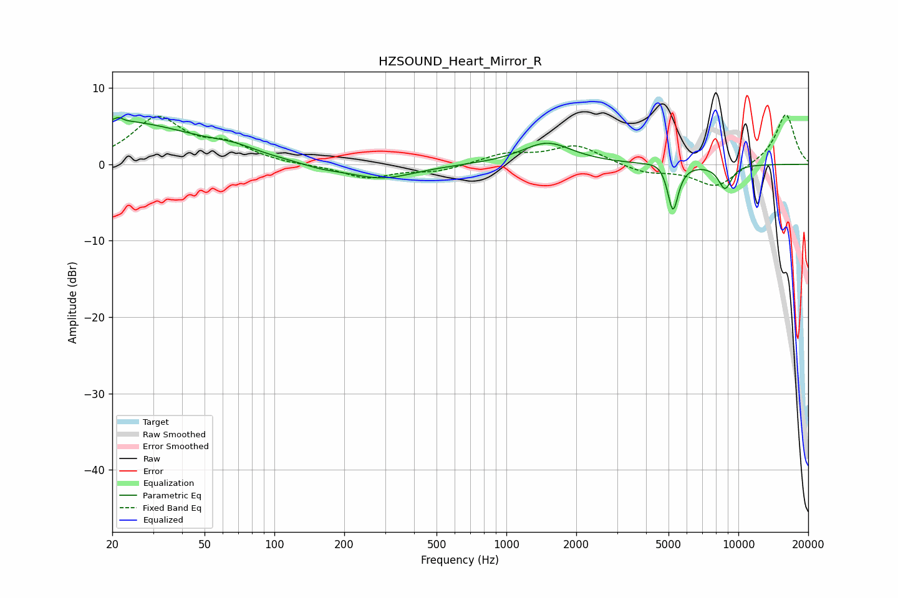

# HZSOUND_Heart_Mirror_R
See [usage instructions](https://github.com/jaakkopasanen/AutoEq#usage) for more options and info.

### Parametric EQs
Apply preamp of -6.2 dB when using parametric equalizer.

|   # | Type    |   Fc (Hz) |    Q |   Gain (dB) |
|-----|---------|-----------|------|-------------|
|   1 | Peaking |        22 | 0.43 |         5.5 |
|   2 | Peaking |        22 | 5.78 |         3.1 |
|   3 | Peaking |        22 | 6    |        -2.6 |
|   4 | Peaking |        67 | 1.49 |         0.7 |
|   5 | Peaking |       159 | 1.65 |        -0.5 |
|   6 | Peaking |       289 | 0.99 |        -1.9 |
|   7 | Peaking |      1497 | 1.31 |         2.8 |
|   8 | Peaking |      4602 | 3.28 |         0.6 |
|   9 | Peaking |      5225 | 5.96 |        -6.3 |
|  10 | Peaking |      8760 | 4.44 |        -3.1 |

### Fixed Band EQs
When using fixed band (also called graphic) equalizer, apply preamp of **-6.6 dB** (if available) and set gains manually with these parameters.

|   # | Type    |   Fc (Hz) |    Q |   Gain (dB) |
|-----|---------|-----------|------|-------------|
|   1 | Peaking |        31 | 1.41 |         5.9 |
|   2 | Peaking |        62 | 1.41 |         2.2 |
|   3 | Peaking |       125 | 1.41 |        -0.1 |
|   4 | Peaking |       250 | 1.41 |        -1.8 |
|   5 | Peaking |       500 | 1.41 |        -0.9 |
|   6 | Peaking |      1000 | 1.41 |         1.3 |
|   7 | Peaking |      2000 | 1.41 |         2.4 |
|   8 | Peaking |      4000 | 1.41 |        -1.1 |
|   9 | Peaking |      8000 | 1.41 |        -3   |
|  10 | Peaking |     16000 | 1.41 |         6.7 |

### Graphs

