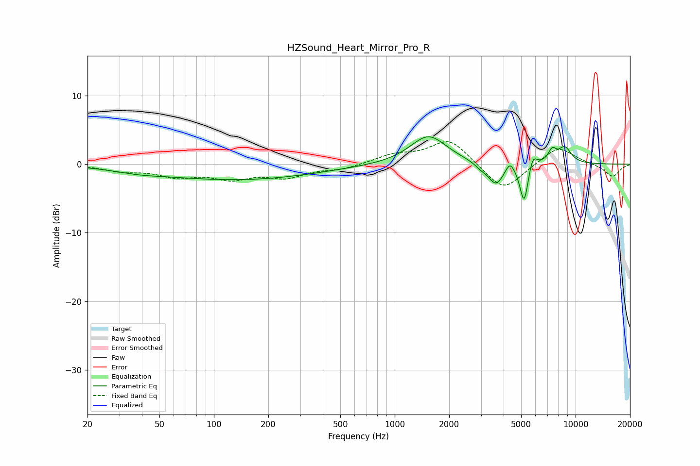

# HZSound_Heart_Mirror_Pro_R
See [usage instructions](https://github.com/jaakkopasanen/AutoEq#usage) for more options and info.

### Parametric EQs
Apply preamp of -4.1 dB when using parametric equalizer.

|   # | Type    |   Fc (Hz) |    Q |   Gain (dB) |
|-----|---------|-----------|------|-------------|
|   1 | Peaking |        38 | 1.08 |        -0.5 |
|   2 | Peaking |       135 | 0.32 |        -2.2 |
|   3 | Peaking |      1537 | 1.4  |         4.2 |
|   4 | Peaking |      2996 | 4.21 |        -0.6 |
|   5 | Peaking |      3631 | 3.29 |        -3.1 |
|   6 | Peaking |      4336 | 6    |         1.5 |
|   7 | Peaking |      5194 | 6    |        -5.9 |
|   8 | Peaking |      5793 | 6    |         2.1 |
|   9 | Peaking |      7428 | 5.91 |         1.7 |
|  10 | Peaking |      8709 | 3.53 |         2.3 |

### Fixed Band EQs
When using fixed band (also called graphic) equalizer, apply preamp of **-3.4 dB** (if available) and set gains manually with these parameters.

|   # | Type    |   Fc (Hz) |    Q |   Gain (dB) |
|-----|---------|-----------|------|-------------|
|   1 | Peaking |        31 | 1.41 |        -0.9 |
|   2 | Peaking |        62 | 1.41 |        -1.6 |
|   3 | Peaking |       125 | 1.41 |        -1.8 |
|   4 | Peaking |       250 | 1.41 |        -1.7 |
|   5 | Peaking |       500 | 1.41 |        -0.7 |
|   6 | Peaking |      1000 | 1.41 |         1.3 |
|   7 | Peaking |      2000 | 1.41 |         3.7 |
|   8 | Peaking |      4000 | 1.41 |        -4.1 |
|   9 | Peaking |      8000 | 1.41 |         2.7 |
|  10 | Peaking |     16000 | 1.41 |        -1.9 |

### Graphs

