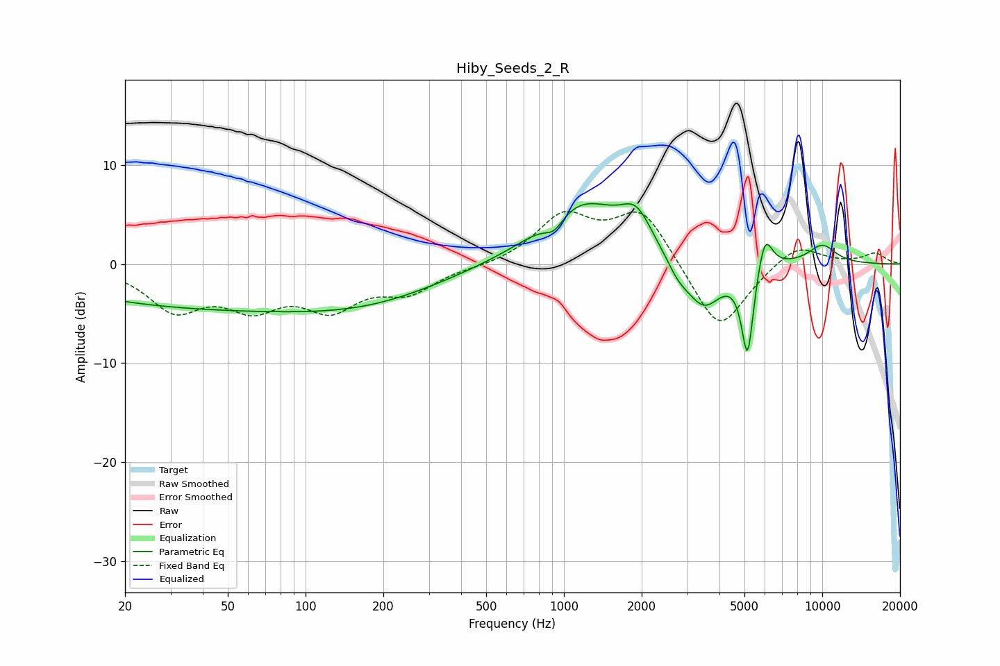

# Hiby_Seeds_2_R
See [usage instructions](https://github.com/jaakkopasanen/AutoEq#usage) for more options and info.

### Parametric EQs
Apply preamp of -6.2 dB when using parametric equalizer.

|   # | Type    |   Fc (Hz) |    Q |   Gain (dB) |
|-----|---------|-----------|------|-------------|
|   1 | Peaking |        43 | 0.23 |        -4.3 |
|   2 | Peaking |       198 | 0.5  |        -2   |
|   3 | Peaking |       916 | 3.74 |        -1.5 |
|   4 | Peaking |      1167 | 0.85 |         6.3 |
|   5 | Peaking |      1907 | 2.37 |         3.3 |
|   6 | Peaking |      2769 | 3.2  |        -1.4 |
|   7 | Peaking |      3475 | 1.96 |        -4.8 |
|   8 | Peaking |      5139 | 5.89 |        -9.1 |
|   9 | Peaking |      5995 | 4.75 |         3.9 |
|  10 | Peaking |     10000 | 2.19 |         1.9 |

### Fixed Band EQs
When using fixed band (also called graphic) equalizer, apply preamp of **-5.4 dB** (if available) and set gains manually with these parameters.

|   # | Type    |   Fc (Hz) |    Q |   Gain (dB) |
|-----|---------|-----------|------|-------------|
|   1 | Peaking |        31 | 1.41 |        -4.3 |
|   2 | Peaking |        62 | 1.41 |        -3.6 |
|   3 | Peaking |       125 | 1.41 |        -3.9 |
|   4 | Peaking |       250 | 1.41 |        -2.5 |
|   5 | Peaking |       500 | 1.41 |        -0.3 |
|   6 | Peaking |      1000 | 1.41 |         4.7 |
|   7 | Peaking |      2000 | 1.41 |         5.5 |
|   8 | Peaking |      4000 | 1.41 |        -7.2 |
|   9 | Peaking |      8000 | 1.41 |         2.2 |
|  10 | Peaking |     16000 | 1.41 |         1.1 |

### Graphs

