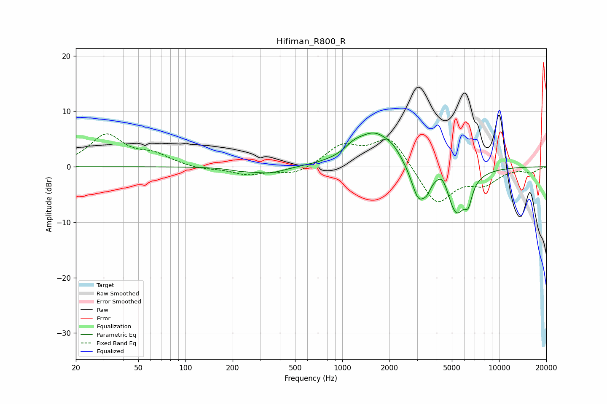

# Hifiman_R800_R
See [usage instructions](https://github.com/jaakkopasanen/AutoEq#usage) for more options and info.

### Parametric EQs
Apply preamp of -6.2 dB when using parametric equalizer.

|   # | Type    |   Fc (Hz) |    Q |   Gain (dB) |
|-----|---------|-----------|------|-------------|
|   1 | Peaking |       224 | 1.82 |        -0.4 |
|   2 | Peaking |       343 | 1.35 |        -1.2 |
|   3 | Peaking |      1174 | 2.56 |         1.2 |
|   4 | Peaking |      1602 | 1.18 |         6   |
|   5 | Peaking |      2103 | 2.74 |         1.1 |
|   6 | Peaking |      3057 | 3.06 |        -6.1 |
|   7 | Peaking |      3459 | 5.69 |        -1.6 |
|   8 | Peaking |      4363 | 3.84 |         2.4 |
|   9 | Peaking |      5331 | 2.19 |        -8.4 |
|  10 | Peaking |      6366 | 6    |        -3   |

### Fixed Band EQs
When using fixed band (also called graphic) equalizer, apply preamp of **-6.0 dB** (if available) and set gains manually with these parameters.

|   # | Type    |   Fc (Hz) |    Q |   Gain (dB) |
|-----|---------|-----------|------|-------------|
|   1 | Peaking |        31 | 1.41 |         5.6 |
|   2 | Peaking |        62 | 1.41 |         1.9 |
|   3 | Peaking |       125 | 1.41 |        -0.5 |
|   4 | Peaking |       250 | 1.41 |        -1.4 |
|   5 | Peaking |       500 | 1.41 |        -1.5 |
|   6 | Peaking |      1000 | 1.41 |         3.6 |
|   7 | Peaking |      2000 | 1.41 |         5.6 |
|   8 | Peaking |      4000 | 1.41 |        -7   |
|   9 | Peaking |      8000 | 1.41 |        -2.7 |
|  10 | Peaking |     16000 | 1.41 |        -1   |

### Graphs

