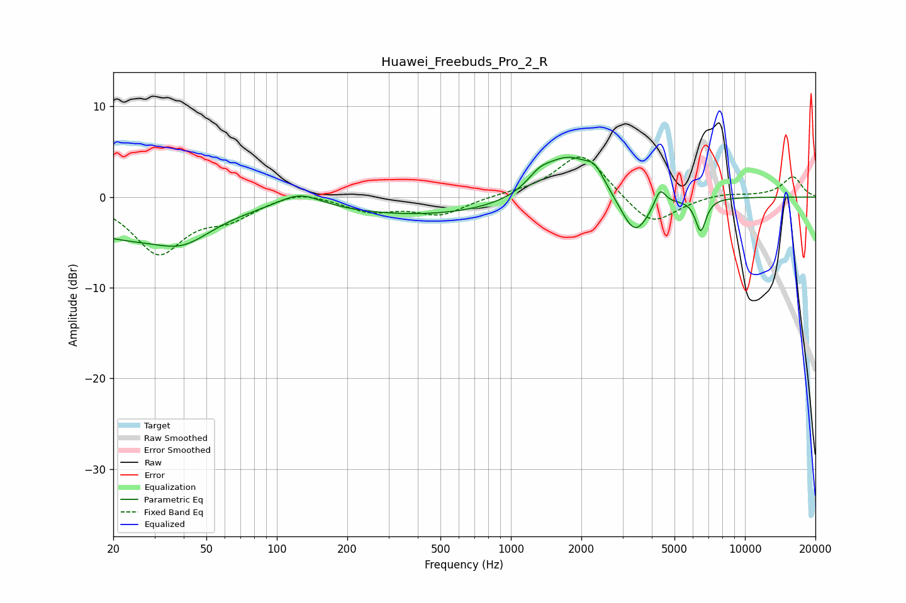

# Huawei_Freebuds_Pro_2_R
See [usage instructions](https://github.com/jaakkopasanen/AutoEq#usage) for more options and info.

### Parametric EQs
Apply preamp of -4.5 dB when using parametric equalizer.

|   # | Type    |   Fc (Hz) |    Q |   Gain (dB) |
|-----|---------|-----------|------|-------------|
|   1 | Peaking |        22 | 0.47 |        -4.1 |
|   2 | Peaking |        40 | 1.25 |        -2.2 |
|   3 | Peaking |       125 | 1.52 |         1.7 |
|   4 | Peaking |       447 | 0.35 |        -2   |
|   5 | Peaking |      1323 | 2.73 |         1.3 |
|   6 | Peaking |      1765 | 1.25 |         4.8 |
|   7 | Peaking |      2287 | 3.64 |         1.6 |
|   8 | Peaking |      3384 | 2.29 |        -4.6 |
|   9 | Peaking |      4339 | 6    |         2   |
|  10 | Peaking |      6473 | 6    |        -3.6 |

### Fixed Band EQs
When using fixed band (also called graphic) equalizer, apply preamp of **-4.5 dB** (if available) and set gains manually with these parameters.

|   # | Type    |   Fc (Hz) |    Q |   Gain (dB) |
|-----|---------|-----------|------|-------------|
|   1 | Peaking |        31 | 1.41 |        -6   |
|   2 | Peaking |        62 | 1.41 |        -1.9 |
|   3 | Peaking |       125 | 1.41 |         0.9 |
|   4 | Peaking |       250 | 1.41 |        -1.5 |
|   5 | Peaking |       500 | 1.41 |        -1.9 |
|   6 | Peaking |      1000 | 1.41 |         0.3 |
|   7 | Peaking |      2000 | 1.41 |         5   |
|   8 | Peaking |      4000 | 1.41 |        -3.4 |
|   9 | Peaking |      8000 | 1.41 |         0.4 |
|  10 | Peaking |     16000 | 1.41 |         2.2 |

### Graphs

