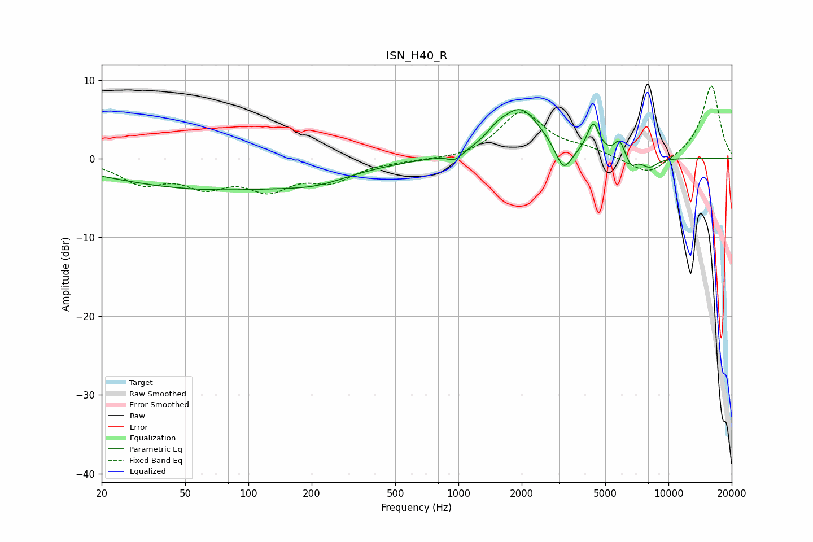

# ISN_H40_R
See [usage instructions](https://github.com/jaakkopasanen/AutoEq#usage) for more options and info.

### Parametric EQs
Apply preamp of -6.3 dB when using parametric equalizer.

|   # | Type    |   Fc (Hz) |    Q |   Gain (dB) |
|-----|---------|-----------|------|-------------|
|   1 | Peaking |        67 | 0.28 |        -3.8 |
|   2 | Peaking |       213 | 0.92 |        -1.1 |
|   3 | Peaking |       964 | 3.99 |        -1   |
|   4 | Peaking |      1514 | 3.16 |         0.9 |
|   5 | Peaking |      1973 | 1.37 |         6.3 |
|   6 | Peaking |      3165 | 3.67 |        -3.4 |
|   7 | Peaking |      4381 | 4.88 |         3.9 |
|   8 | Peaking |      5839 | 5.98 |         2   |
|   9 | Peaking |      6649 | 5.99 |        -1.3 |
|  10 | Peaking |      8107 | 3.37 |        -1.2 |

### Fixed Band EQs
When using fixed band (also called graphic) equalizer, apply preamp of **-9.3 dB** (if available) and set gains manually with these parameters.

|   # | Type    |   Fc (Hz) |    Q |   Gain (dB) |
|-----|---------|-----------|------|-------------|
|   1 | Peaking |        31 | 1.41 |        -2.8 |
|   2 | Peaking |        62 | 1.41 |        -3   |
|   3 | Peaking |       125 | 1.41 |        -3.4 |
|   4 | Peaking |       250 | 1.41 |        -2.5 |
|   5 | Peaking |       500 | 1.41 |        -0.2 |
|   6 | Peaking |      1000 | 1.41 |        -0.3 |
|   7 | Peaking |      2000 | 1.41 |         5.9 |
|   8 | Peaking |      4000 | 1.41 |         0.9 |
|   9 | Peaking |      8000 | 1.41 |        -2.3 |
|  10 | Peaking |     16000 | 1.41 |         9.4 |

### Graphs

