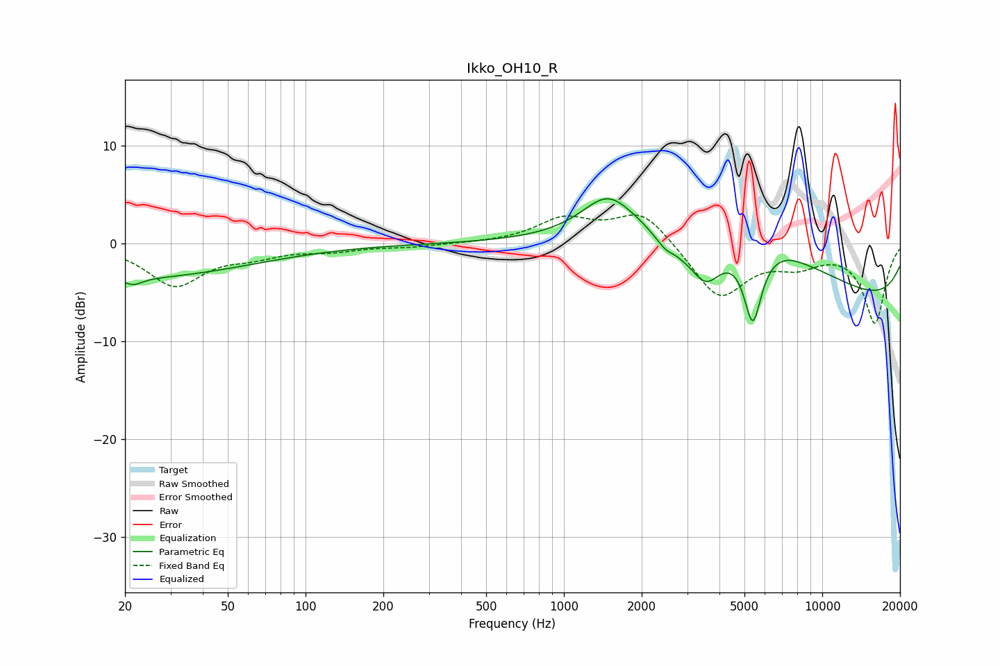

# Ikko_OH10_R
See [usage instructions](https://github.com/jaakkopasanen/AutoEq#usage) for more options and info.

### Parametric EQs
Apply preamp of -4.7 dB when using parametric equalizer.

|   # | Type    |   Fc (Hz) |    Q |   Gain (dB) |
|-----|---------|-----------|------|-------------|
|   1 | Peaking |        20 | 0.29 |        -3.5 |
|   2 | Peaking |        22 | 4.27 |        -0.7 |
|   3 | Peaking |      1481 | 1.42 |         4   |
|   4 | Peaking |      2591 | 2.73 |        -2.4 |
|   5 | Peaking |      2668 | 5.09 |         0.7 |
|   6 | Peaking |      3534 | 2.21 |        -4.5 |
|   7 | Peaking |      4621 | 0.35 |         6.8 |
|   8 | Peaking |      5382 | 4.05 |        -7.5 |
|   9 | Peaking |      7182 | 2.21 |         0.3 |
|  10 | Peaking |     10000 | 0.18 |        -6.9 |

### Fixed Band EQs
When using fixed band (also called graphic) equalizer, apply preamp of **-3.0 dB** (if available) and set gains manually with these parameters.

|   # | Type    |   Fc (Hz) |    Q |   Gain (dB) |
|-----|---------|-----------|------|-------------|
|   1 | Peaking |        31 | 1.41 |        -4.2 |
|   2 | Peaking |        62 | 1.41 |        -1   |
|   3 | Peaking |       125 | 1.41 |        -0.6 |
|   4 | Peaking |       250 | 1.41 |        -0.3 |
|   5 | Peaking |       500 | 1.41 |         0   |
|   6 | Peaking |      1000 | 1.41 |         2.4 |
|   7 | Peaking |      2000 | 1.41 |         3.4 |
|   8 | Peaking |      4000 | 1.41 |        -5.6 |
|   9 | Peaking |      8000 | 1.41 |        -1.7 |
|  10 | Peaking |     16000 | 1.41 |        -8   |

### Graphs

