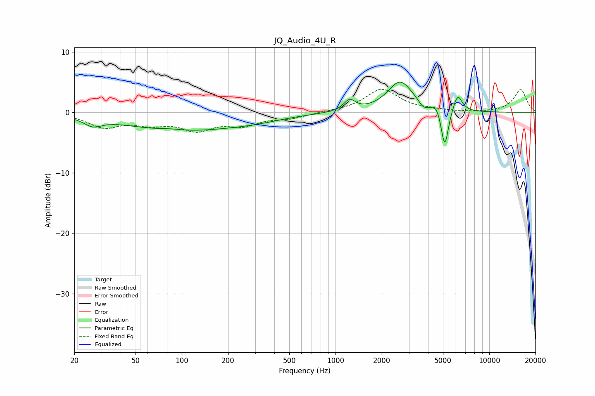

# JQ_Audio_4U_R
See [usage instructions](https://github.com/jaakkopasanen/AutoEq#usage) for more options and info.

### Parametric EQs
Apply preamp of -5.1 dB when using parametric equalizer.

|   # | Type    |   Fc (Hz) |    Q |   Gain (dB) |
|-----|---------|-----------|------|-------------|
|   1 | Peaking |        26 | 2.45 |        -1.3 |
|   2 | Peaking |        84 | 1.64 |         0.4 |
|   3 | Peaking |        95 | 0.4  |        -3   |
|   4 | Peaking |       302 | 0.74 |        -0.8 |
|   5 | Peaking |      1234 | 3.81 |         1.8 |
|   6 | Peaking |      2637 | 1.71 |         5.1 |
|   7 | Peaking |      3719 | 5.4  |        -0.9 |
|   8 | Peaking |      4542 | 6    |         1   |
|   9 | Peaking |      5140 | 6    |        -6.4 |
|  10 | Peaking |      6231 | 4.75 |         2.9 |

### Fixed Band EQs
When using fixed band (also called graphic) equalizer, apply preamp of **-3.9 dB** (if available) and set gains manually with these parameters.

|   # | Type    |   Fc (Hz) |    Q |   Gain (dB) |
|-----|---------|-----------|------|-------------|
|   1 | Peaking |        31 | 1.41 |        -2.2 |
|   2 | Peaking |        62 | 1.41 |        -1.5 |
|   3 | Peaking |       125 | 1.41 |        -2.6 |
|   4 | Peaking |       250 | 1.41 |        -1.8 |
|   5 | Peaking |       500 | 1.41 |        -0.8 |
|   6 | Peaking |      1000 | 1.41 |         0.1 |
|   7 | Peaking |      2000 | 1.41 |         3.8 |
|   8 | Peaking |      4000 | 1.41 |         0.3 |
|   9 | Peaking |      8000 | 1.41 |        -0.1 |
|  10 | Peaking |     16000 | 1.41 |         3.8 |

### Graphs

