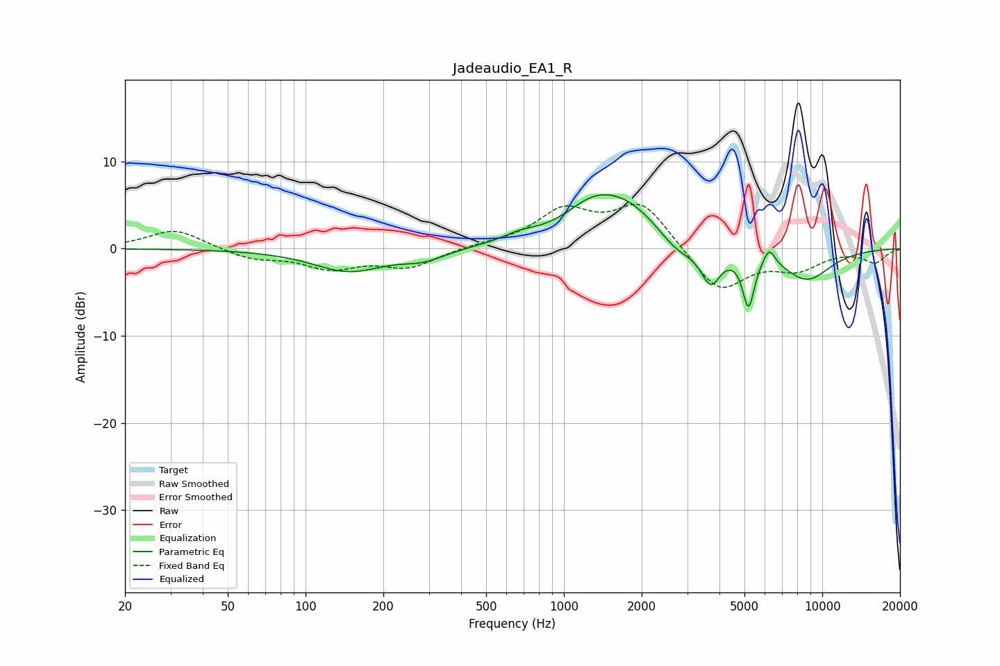

# Jadeaudio_EA1_R
See [usage instructions](https://github.com/jaakkopasanen/AutoEq#usage) for more options and info.

### Parametric EQs
Apply preamp of -6.3 dB when using parametric equalizer.

|   # | Type    |   Fc (Hz) |    Q |   Gain (dB) |
|-----|---------|-----------|------|-------------|
|   1 | Peaking |       147 | 1.03 |        -2.6 |
|   2 | Peaking |       286 | 1.72 |        -1.1 |
|   3 | Peaking |       673 | 2.08 |         0.7 |
|   4 | Peaking |      1263 | 1.59 |         1.6 |
|   5 | Peaking |      1664 | 0.86 |         5.6 |
|   6 | Peaking |      2738 | 1.82 |        -2.4 |
|   7 | Peaking |      3701 | 3.62 |        -4.2 |
|   8 | Peaking |      5183 | 6    |        -6   |
|   9 | Peaking |      6230 | 5.98 |         1.9 |
|  10 | Peaking |      8713 | 1.33 |        -3.6 |

### Fixed Band EQs
When using fixed band (also called graphic) equalizer, apply preamp of **-5.2 dB** (if available) and set gains manually with these parameters.

|   # | Type    |   Fc (Hz) |    Q |   Gain (dB) |
|-----|---------|-----------|------|-------------|
|   1 | Peaking |        31 | 1.41 |         2.3 |
|   2 | Peaking |        62 | 1.41 |        -1.1 |
|   3 | Peaking |       125 | 1.41 |        -2.1 |
|   4 | Peaking |       250 | 1.41 |        -2.1 |
|   5 | Peaking |       500 | 1.41 |         0.4 |
|   6 | Peaking |      1000 | 1.41 |         4.1 |
|   7 | Peaking |      2000 | 1.41 |         5.2 |
|   8 | Peaking |      4000 | 1.41 |        -5.1 |
|   9 | Peaking |      8000 | 1.41 |        -2.1 |
|  10 | Peaking |     16000 | 1.41 |        -1.5 |

### Graphs

