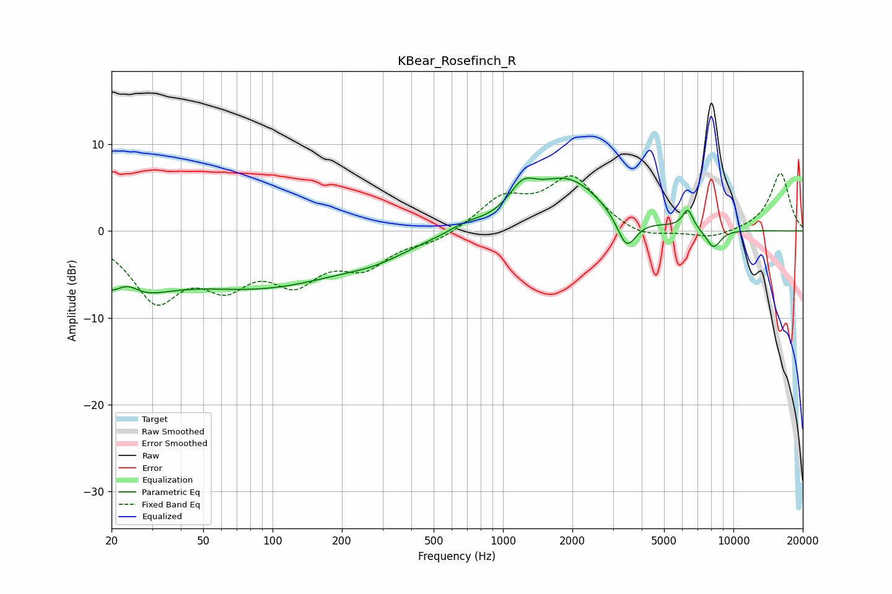

# KBear_Rosefinch_R
See [usage instructions](https://github.com/jaakkopasanen/AutoEq#usage) for more options and info.

### Parametric EQs
Apply preamp of -6.2 dB when using parametric equalizer.

|   # | Type    |   Fc (Hz) |    Q |   Gain (dB) |
|-----|---------|-----------|------|-------------|
|   1 | Peaking |        22 | 0.94 |        -6.9 |
|   2 | Peaking |        23 | 2.38 |         2.8 |
|   3 | Peaking |        90 | 0.35 |        -6.1 |
|   4 | Peaking |       283 | 1.06 |        -1   |
|   5 | Peaking |       684 | 2.05 |         0.7 |
|   6 | Peaking |      1217 | 2.45 |         2.8 |
|   7 | Peaking |      1903 | 0.9  |         5.9 |
|   8 | Peaking |      3437 | 3.31 |        -4   |
|   9 | Peaking |      6334 | 6    |         2.2 |
|  10 | Peaking |      8195 | 4.02 |        -2.2 |

### Fixed Band EQs
When using fixed band (also called graphic) equalizer, apply preamp of **-6.7 dB** (if available) and set gains manually with these parameters.

|   # | Type    |   Fc (Hz) |    Q |   Gain (dB) |
|-----|---------|-----------|------|-------------|
|   1 | Peaking |        31 | 1.41 |        -7.4 |
|   2 | Peaking |        62 | 1.41 |        -4.9 |
|   3 | Peaking |       125 | 1.41 |        -4.9 |
|   4 | Peaking |       250 | 1.41 |        -3.6 |
|   5 | Peaking |       500 | 1.41 |        -1.1 |
|   6 | Peaking |      1000 | 1.41 |         3.5 |
|   7 | Peaking |      2000 | 1.41 |         6   |
|   8 | Peaking |      4000 | 1.41 |        -1.1 |
|   9 | Peaking |      8000 | 1.41 |        -0.9 |
|  10 | Peaking |     16000 | 1.41 |         6.7 |

### Graphs

