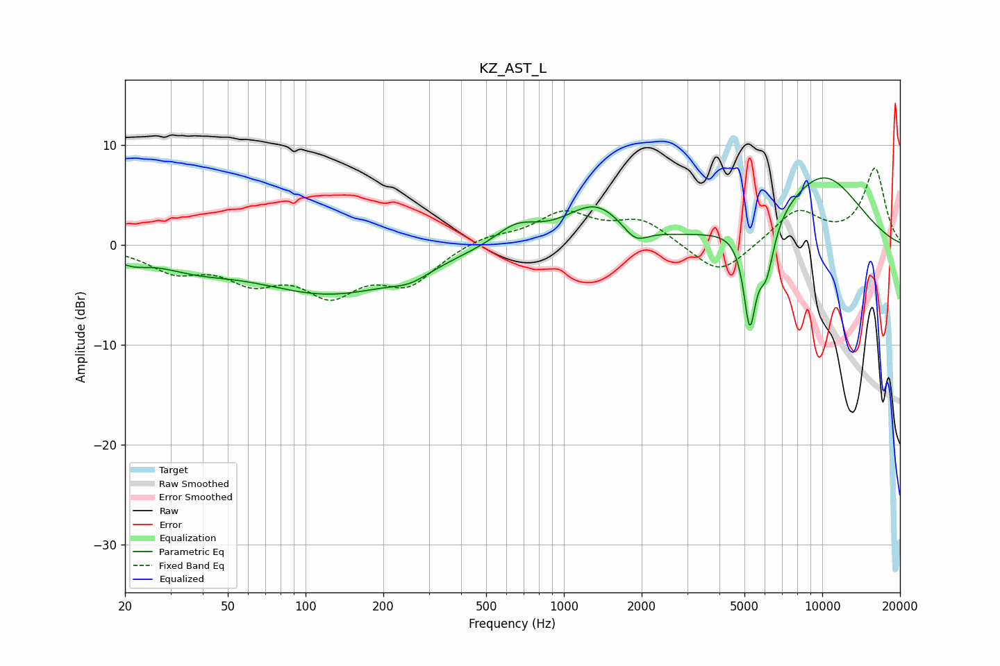

# KZ_AST_L
See [usage instructions](https://github.com/jaakkopasanen/AutoEq#usage) for more options and info.

### Parametric EQs
Apply preamp of -6.8 dB when using parametric equalizer.

|   # | Type    |   Fc (Hz) |    Q |   Gain (dB) |
|-----|---------|-----------|------|-------------|
|   1 | Peaking |        21 | 2.26 |        -1   |
|   2 | Peaking |        37 | 0.95 |        -1.4 |
|   3 | Peaking |       125 | 0.48 |        -4.7 |
|   4 | Peaking |       255 | 1.84 |        -1   |
|   5 | Peaking |       654 | 1.66 |         2   |
|   6 | Peaking |      1322 | 1.22 |         3.9 |
|   7 | Peaking |      1889 | 2.95 |        -1.7 |
|   8 | Peaking |      5241 | 5.67 |        -9.4 |
|   9 | Peaking |      6077 | 4.44 |        -4.9 |
|  10 | Peaking |     10000 | 0.72 |         6.9 |

### Fixed Band EQs
When using fixed band (also called graphic) equalizer, apply preamp of **-7.8 dB** (if available) and set gains manually with these parameters.

|   # | Type    |   Fc (Hz) |    Q |   Gain (dB) |
|-----|---------|-----------|------|-------------|
|   1 | Peaking |        31 | 1.41 |        -2.3 |
|   2 | Peaking |        62 | 1.41 |        -3   |
|   3 | Peaking |       125 | 1.41 |        -4.3 |
|   4 | Peaking |       250 | 1.41 |        -3.6 |
|   5 | Peaking |       500 | 1.41 |         0.9 |
|   6 | Peaking |      1000 | 1.41 |         3.1 |
|   7 | Peaking |      2000 | 1.41 |         2.4 |
|   8 | Peaking |      4000 | 1.41 |        -3.3 |
|   9 | Peaking |      8000 | 1.41 |         3.4 |
|  10 | Peaking |     16000 | 1.41 |         7.6 |

### Graphs

