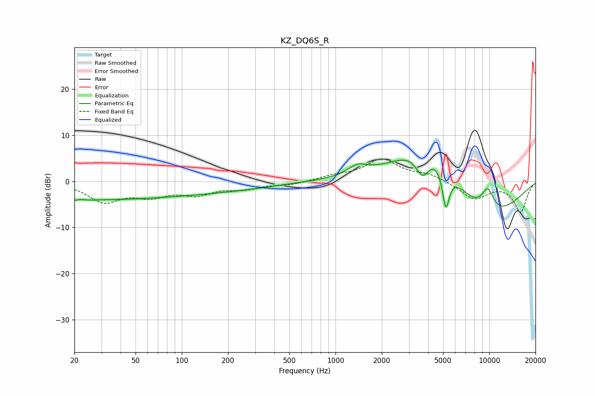

# KZ_DQ6S_R
See [usage instructions](https://github.com/jaakkopasanen/AutoEq#usage) for more options and info.

### Parametric EQs
Apply preamp of -4.7 dB when using parametric equalizer.

|   # | Type    |   Fc (Hz) |    Q |   Gain (dB) |
|-----|---------|-----------|------|-------------|
|   1 | Peaking |        21 | 3.19 |        -3.7 |
|   2 | Peaking |        21 | 3.39 |         3.7 |
|   3 | Peaking |        21 | 0.18 |        -3.9 |
|   4 | Peaking |       206 | 0.46 |        -1.3 |
|   5 | Peaking |      1387 | 2.27 |         1.9 |
|   6 | Peaking |      3690 | 2.87 |        -6.3 |
|   7 | Peaking |      3997 | 0.75 |        11.4 |
|   8 | Peaking |      5225 | 6    |        -8.5 |
|   9 | Peaking |      9448 | 0.55 |        -9.6 |
|  10 | Peaking |      9784 | 2.87 |         5.4 |

### Fixed Band EQs
When using fixed band (also called graphic) equalizer, apply preamp of **-4.9 dB** (if available) and set gains manually with these parameters.

|   # | Type    |   Fc (Hz) |    Q |   Gain (dB) |
|-----|---------|-----------|------|-------------|
|   1 | Peaking |        31 | 1.41 |        -4.2 |
|   2 | Peaking |        62 | 1.41 |        -2.7 |
|   3 | Peaking |       125 | 1.41 |        -2.4 |
|   4 | Peaking |       250 | 1.41 |        -1.4 |
|   5 | Peaking |       500 | 1.41 |        -0.7 |
|   6 | Peaking |      1000 | 1.41 |         1   |
|   7 | Peaking |      2000 | 1.41 |         4.6 |
|   8 | Peaking |      4000 | 1.41 |         1.4 |
|   9 | Peaking |      8000 | 1.41 |        -3.8 |
|  10 | Peaking |     16000 | 1.41 |        -6.5 |

### Graphs

