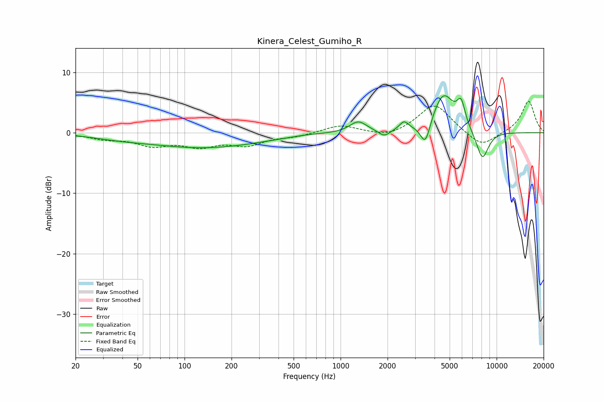

# Kinera_Celest_Gumiho_R
See [usage instructions](https://github.com/jaakkopasanen/AutoEq#usage) for more options and info.

### Parametric EQs
Apply preamp of -6.2 dB when using parametric equalizer.

|   # | Type    |   Fc (Hz) |    Q |   Gain (dB) |
|-----|---------|-----------|------|-------------|
|   1 | Peaking |        38 | 0.88 |        -0.5 |
|   2 | Peaking |       134 | 0.38 |        -2.4 |
|   3 | Peaking |       611 | 1.26 |         0.2 |
|   4 | Peaking |      1298 | 2.58 |         1.9 |
|   5 | Peaking |      1904 | 3.95 |        -1.1 |
|   6 | Peaking |      2550 | 4.93 |         1.4 |
|   7 | Peaking |      3494 | 4.4  |        -4   |
|   8 | Peaking |      4556 | 1.96 |         6.5 |
|   9 | Peaking |      5921 | 5.31 |         3.6 |
|  10 | Peaking |      8099 | 3.25 |        -4.9 |

### Fixed Band EQs
When using fixed band (also called graphic) equalizer, apply preamp of **-5.3 dB** (if available) and set gains manually with these parameters.

|   # | Type    |   Fc (Hz) |    Q |   Gain (dB) |
|-----|---------|-----------|------|-------------|
|   1 | Peaking |        31 | 1.41 |        -0.9 |
|   2 | Peaking |        62 | 1.41 |        -1.9 |
|   3 | Peaking |       125 | 1.41 |        -1.9 |
|   4 | Peaking |       250 | 1.41 |        -1.8 |
|   5 | Peaking |       500 | 1.41 |        -0.6 |
|   6 | Peaking |      1000 | 1.41 |         1.3 |
|   7 | Peaking |      2000 | 1.41 |        -0.9 |
|   8 | Peaking |      4000 | 1.41 |         4.8 |
|   9 | Peaking |      8000 | 1.41 |        -2.5 |
|  10 | Peaking |     16000 | 1.41 |         5.3 |

### Graphs

