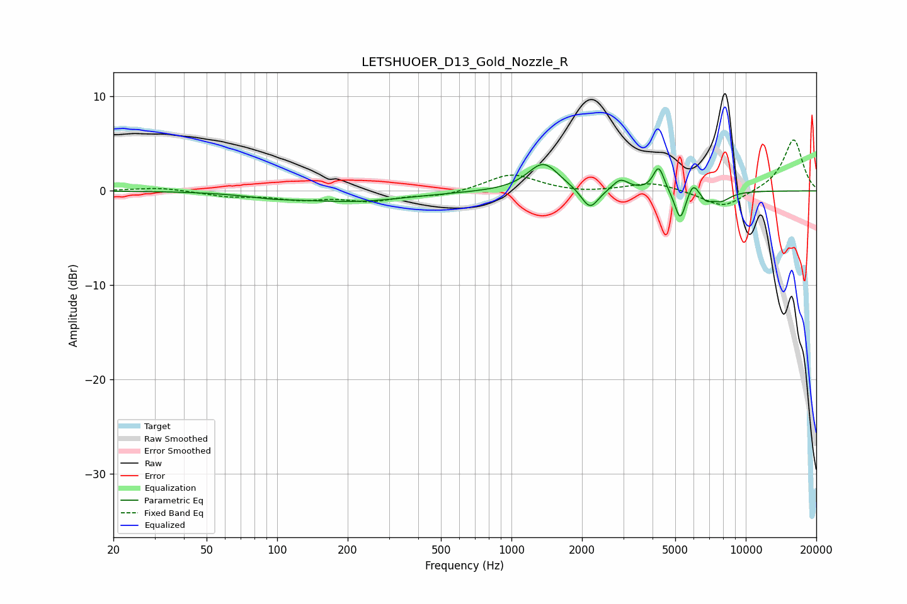

# LETSHUOER_D13_Gold_Nozzle_R
See [usage instructions](https://github.com/jaakkopasanen/AutoEq#usage) for more options and info.

### Parametric EQs
Apply preamp of -2.9 dB when using parametric equalizer.

|   # | Type    |   Fc (Hz) |    Q |   Gain (dB) |
|-----|---------|-----------|------|-------------|
|   1 | Peaking |        95 | 1.23 |        -0.4 |
|   2 | Peaking |       212 | 0.6  |        -1.1 |
|   3 | Peaking |      1368 | 2.14 |         3   |
|   4 | Peaking |      2163 | 3.86 |        -2.3 |
|   5 | Peaking |      2920 | 4.15 |         1.2 |
|   6 | Peaking |      4250 | 6    |         2.6 |
|   7 | Peaking |      5253 | 5.99 |        -3.3 |
|   8 | Peaking |      5956 | 5.99 |         1.4 |
|   9 | Peaking |      6776 | 6    |        -0.8 |
|  10 | Peaking |      7808 | 3.09 |        -1   |

### Fixed Band EQs
When using fixed band (also called graphic) equalizer, apply preamp of **-5.5 dB** (if available) and set gains manually with these parameters.

|   # | Type    |   Fc (Hz) |    Q |   Gain (dB) |
|-----|---------|-----------|------|-------------|
|   1 | Peaking |        31 | 1.41 |         0.4 |
|   2 | Peaking |        62 | 1.41 |        -0.5 |
|   3 | Peaking |       125 | 1.41 |        -0.8 |
|   4 | Peaking |       250 | 1.41 |        -1   |
|   5 | Peaking |       500 | 1.41 |        -0.5 |
|   6 | Peaking |      1000 | 1.41 |         1.8 |
|   7 | Peaking |      2000 | 1.41 |        -0.2 |
|   8 | Peaking |      4000 | 1.41 |         0.9 |
|   9 | Peaking |      8000 | 1.41 |        -1.9 |
|  10 | Peaking |     16000 | 1.41 |         5.5 |

### Graphs

