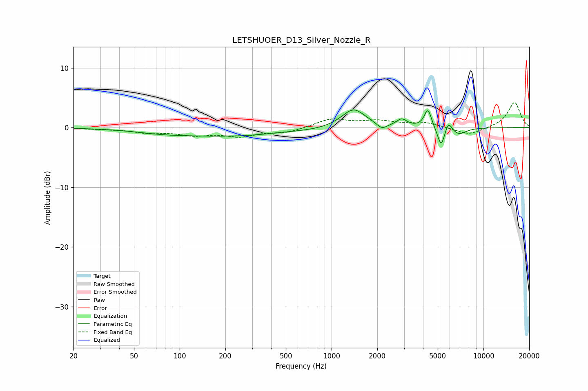

# LETSHUOER_D13_Silver_Nozzle_R
See [usage instructions](https://github.com/jaakkopasanen/AutoEq#usage) for more options and info.

### Parametric EQs
Apply preamp of -3.0 dB when using parametric equalizer.

|   # | Type    |   Fc (Hz) |    Q |   Gain (dB) |
|-----|---------|-----------|------|-------------|
|   1 | Peaking |        74 | 0.92 |        -0.3 |
|   2 | Peaking |       228 | 0.32 |        -1.5 |
|   3 | Peaking |       459 | 1.03 |         0.2 |
|   4 | Peaking |      1395 | 1.79 |         3.3 |
|   5 | Peaking |      2146 | 4.48 |        -0.9 |
|   6 | Peaking |      2898 | 4.13 |         1.2 |
|   7 | Peaking |      4307 | 5.98 |         3.1 |
|   8 | Peaking |      5266 | 6    |        -3.3 |
|   9 | Peaking |      5878 | 6    |         1.8 |
|  10 | Peaking |      6863 | 2.79 |        -1.2 |

### Fixed Band EQs
When using fixed band (also called graphic) equalizer, apply preamp of **-4.3 dB** (if available) and set gains manually with these parameters.

|   # | Type    |   Fc (Hz) |    Q |   Gain (dB) |
|-----|---------|-----------|------|-------------|
|   1 | Peaking |        31 | 1.41 |        -0.2 |
|   2 | Peaking |        62 | 1.41 |        -0.7 |
|   3 | Peaking |       125 | 1.41 |        -1.1 |
|   4 | Peaking |       250 | 1.41 |        -1.3 |
|   5 | Peaking |       500 | 1.41 |        -0.8 |
|   6 | Peaking |      1000 | 1.41 |         1.4 |
|   7 | Peaking |      2000 | 1.41 |         1   |
|   8 | Peaking |      4000 | 1.41 |         0.8 |
|   9 | Peaking |      8000 | 1.41 |        -1.3 |
|  10 | Peaking |     16000 | 1.41 |         4.3 |

### Graphs

