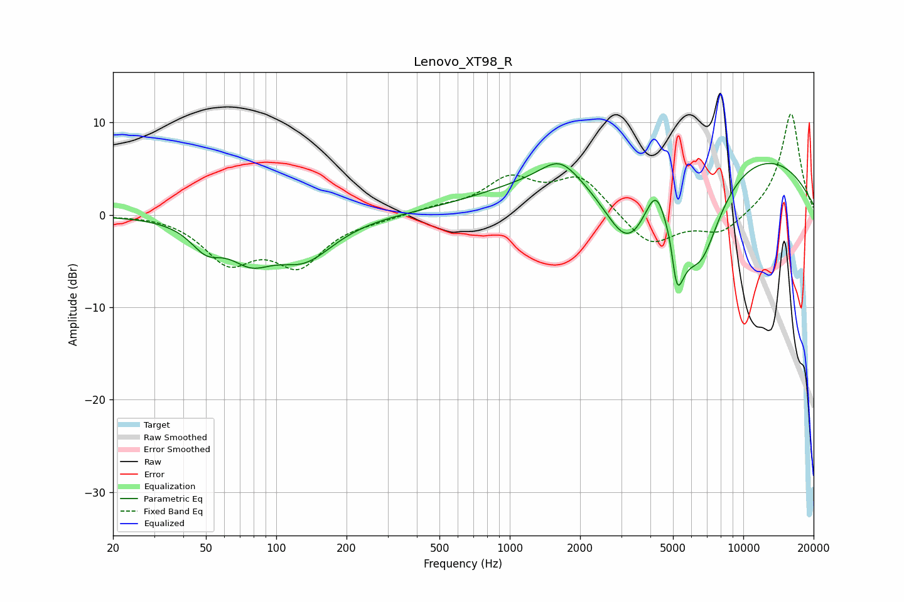

# Lenovo_XT98_R
See [usage instructions](https://github.com/jaakkopasanen/AutoEq#usage) for more options and info.

### Parametric EQs
Apply preamp of -5.7 dB when using parametric equalizer.

|   # | Type    |   Fc (Hz) |    Q |   Gain (dB) |
|-----|---------|-----------|------|-------------|
|   1 | Peaking |        50 | 2.1  |        -2.6 |
|   2 | Peaking |        78 | 1.5  |        -3.5 |
|   3 | Peaking |       132 | 1.1  |        -4.3 |
|   4 | Peaking |      1636 | 1.8  |         2.3 |
|   5 | Peaking |      3206 | 1.18 |        -9.2 |
|   6 | Peaking |      4266 | 2.83 |         5   |
|   7 | Peaking |      4927 | 5.92 |         3.2 |
|   8 | Peaking |      5139 | 3.91 |       -10.2 |
|   9 | Peaking |      5981 | 0.18 |         8.7 |
|  10 | Peaking |      6571 | 1.37 |       -10.6 |

### Fixed Band EQs
When using fixed band (also called graphic) equalizer, apply preamp of **-11.0 dB** (if available) and set gains manually with these parameters.

|   # | Type    |   Fc (Hz) |    Q |   Gain (dB) |
|-----|---------|-----------|------|-------------|
|   1 | Peaking |        31 | 1.41 |         0.2 |
|   2 | Peaking |        62 | 1.41 |        -4.7 |
|   3 | Peaking |       125 | 1.41 |        -5   |
|   4 | Peaking |       250 | 1.41 |        -0.4 |
|   5 | Peaking |       500 | 1.41 |         0.6 |
|   6 | Peaking |      1000 | 1.41 |         3.6 |
|   7 | Peaking |      2000 | 1.41 |         4   |
|   8 | Peaking |      4000 | 1.41 |        -3.5 |
|   9 | Peaking |      8000 | 1.41 |        -2.1 |
|  10 | Peaking |     16000 | 1.41 |        11.1 |

### Graphs

