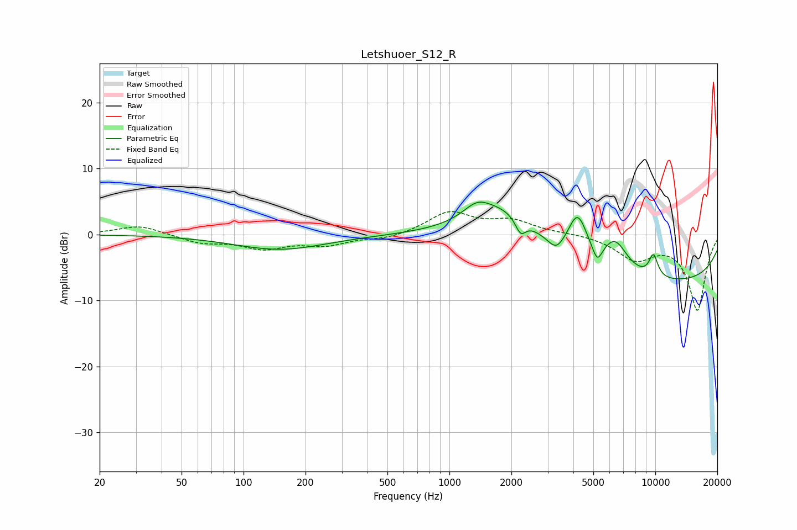

# Letshuoer_S12_R
See [usage instructions](https://github.com/jaakkopasanen/AutoEq#usage) for more options and info.

### Parametric EQs
Apply preamp of -5.0 dB when using parametric equalizer.

|   # | Type    |   Fc (Hz) |    Q |   Gain (dB) |
|-----|---------|-----------|------|-------------|
|   1 | Peaking |       150 | 0.64 |        -2.3 |
|   2 | Peaking |      1360 | 2.17 |         2.1 |
|   3 | Peaking |      1867 | 0.78 |         6.2 |
|   4 | Peaking |      2215 | 5.57 |        -2.4 |
|   5 | Peaking |      3306 | 3.64 |        -1.9 |
|   6 | Peaking |      4194 | 2.92 |         6.5 |
|   7 | Peaking |      5226 | 5.92 |        -2.5 |
|   8 | Peaking |      6378 | 2.2  |         4.6 |
|   9 | Peaking |      9793 | 5.65 |         3.3 |
|  10 | Peaking |      9844 | 0.19 |        -7.4 |

### Fixed Band EQs
When using fixed band (also called graphic) equalizer, apply preamp of **-3.6 dB** (if available) and set gains manually with these parameters.

|   # | Type    |   Fc (Hz) |    Q |   Gain (dB) |
|-----|---------|-----------|------|-------------|
|   1 | Peaking |        31 | 1.41 |         1.4 |
|   2 | Peaking |        62 | 1.41 |        -1.2 |
|   3 | Peaking |       125 | 1.41 |        -1.9 |
|   4 | Peaking |       250 | 1.41 |        -1.4 |
|   5 | Peaking |       500 | 1.41 |        -0.7 |
|   6 | Peaking |      1000 | 1.41 |         3.3 |
|   7 | Peaking |      2000 | 1.41 |         2   |
|   8 | Peaking |      4000 | 1.41 |         0.2 |
|   9 | Peaking |      8000 | 1.41 |        -3.5 |
|  10 | Peaking |     16000 | 1.41 |       -11.4 |

### Graphs

