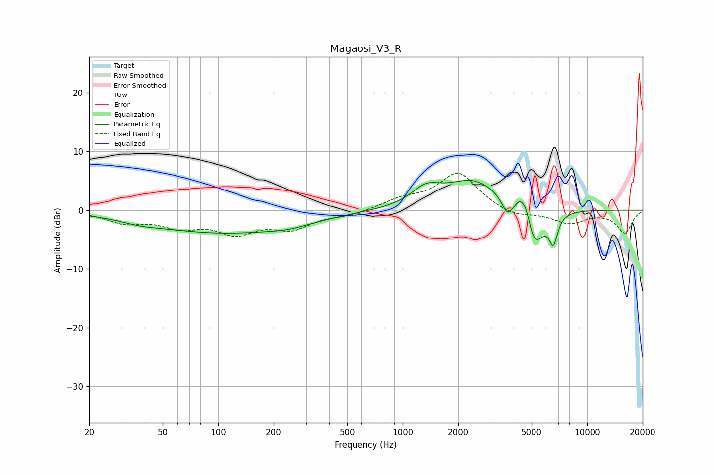

# Magaosi_V3_R
See [usage instructions](https://github.com/jaakkopasanen/AutoEq#usage) for more options and info.

### Parametric EQs
Apply preamp of -5.2 dB when using parametric equalizer.

|   # | Type    |   Fc (Hz) |    Q |   Gain (dB) |
|-----|---------|-----------|------|-------------|
|   1 | Peaking |        38 | 1.39 |        -0.6 |
|   2 | Peaking |       107 | 0.36 |        -3.8 |
|   3 | Peaking |       243 | 1.19 |        -0.7 |
|   4 | Peaking |      1338 | 1.83 |         2.7 |
|   5 | Peaking |      2439 | 0.9  |         5.1 |
|   6 | Peaking |      3682 | 5.02 |        -2.5 |
|   7 | Peaking |      4308 | 6    |         1.8 |
|   8 | Peaking |      4669 | 5.36 |         3.3 |
|   9 | Peaking |      5158 | 2.57 |        -7.2 |
|  10 | Peaking |      6567 | 6    |        -4.6 |

### Fixed Band EQs
When using fixed band (also called graphic) equalizer, apply preamp of **-6.4 dB** (if available) and set gains manually with these parameters.

|   # | Type    |   Fc (Hz) |    Q |   Gain (dB) |
|-----|---------|-----------|------|-------------|
|   1 | Peaking |        31 | 1.41 |        -1.9 |
|   2 | Peaking |        62 | 1.41 |        -2.4 |
|   3 | Peaking |       125 | 1.41 |        -3.5 |
|   4 | Peaking |       250 | 1.41 |        -2.8 |
|   5 | Peaking |       500 | 1.41 |        -0.8 |
|   6 | Peaking |      1000 | 1.41 |         1.6 |
|   7 | Peaking |      2000 | 1.41 |         6.3 |
|   8 | Peaking |      4000 | 1.41 |        -1.2 |
|   9 | Peaking |      8000 | 1.41 |        -2.1 |
|  10 | Peaking |     16000 | 1.41 |        -3.8 |

### Graphs

