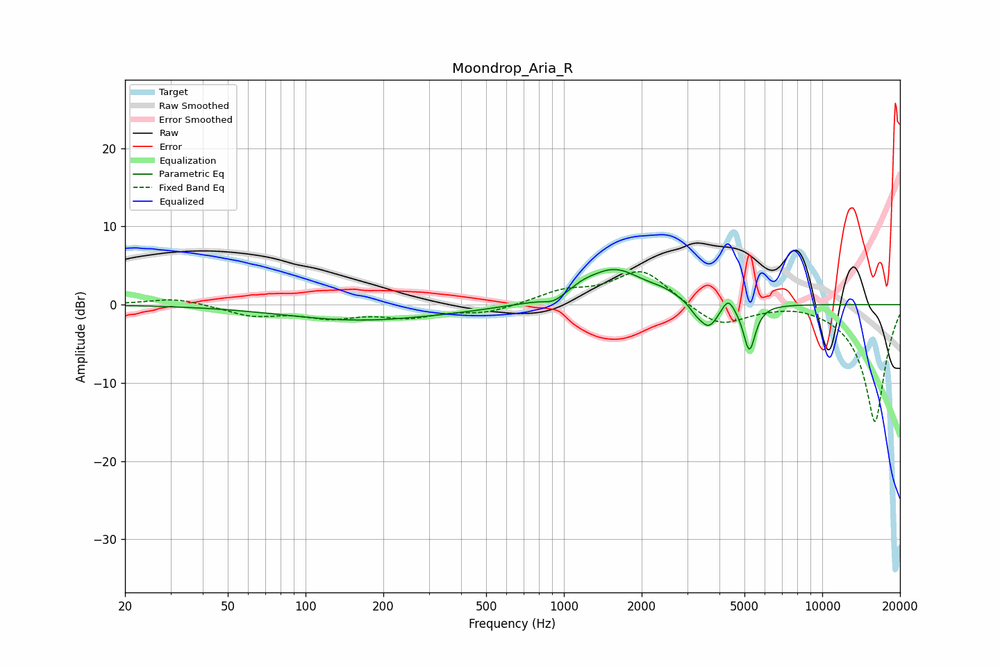

# Moondrop_Aria_R
See [usage instructions](https://github.com/jaakkopasanen/AutoEq#usage) for more options and info.

### Parametric EQs
Apply preamp of -4.6 dB when using parametric equalizer.

|   # | Type    |   Fc (Hz) |    Q |   Gain (dB) |
|-----|---------|-----------|------|-------------|
|   1 | Peaking |       160 | 0.48 |        -1.9 |
|   2 | Peaking |       403 | 0.85 |        -0.2 |
|   3 | Peaking |       913 | 3.7  |        -0.8 |
|   4 | Peaking |      1185 | 3.29 |         0.5 |
|   5 | Peaking |      1563 | 1.22 |         4.5 |
|   6 | Peaking |      2431 | 2.55 |         0.6 |
|   7 | Peaking |      3233 | 6    |        -0.7 |
|   8 | Peaking |      3631 | 3.75 |        -3.3 |
|   9 | Peaking |      4325 | 6    |         1.8 |
|  10 | Peaking |      5224 | 5.99 |        -5.9 |

### Fixed Band EQs
When using fixed band (also called graphic) equalizer, apply preamp of **-4.3 dB** (if available) and set gains manually with these parameters.

|   # | Type    |   Fc (Hz) |    Q |   Gain (dB) |
|-----|---------|-----------|------|-------------|
|   1 | Peaking |        31 | 1.41 |         0.9 |
|   2 | Peaking |        62 | 1.41 |        -1.3 |
|   3 | Peaking |       125 | 1.41 |        -1.4 |
|   4 | Peaking |       250 | 1.41 |        -1.4 |
|   5 | Peaking |       500 | 1.41 |        -1   |
|   6 | Peaking |      1000 | 1.41 |         1.6 |
|   7 | Peaking |      2000 | 1.41 |         4.5 |
|   8 | Peaking |      4000 | 1.41 |        -2.9 |
|   9 | Peaking |      8000 | 1.41 |         0.5 |
|  10 | Peaking |     16000 | 1.41 |       -15.1 |

### Graphs

