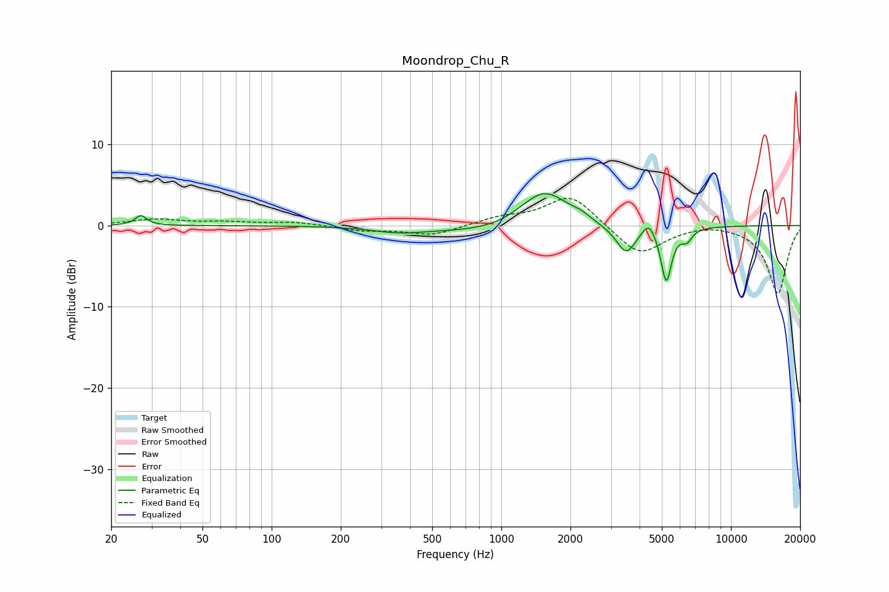

# Moondrop_Chu_R
See [usage instructions](https://github.com/jaakkopasanen/AutoEq#usage) for more options and info.

### Parametric EQs
Apply preamp of -4.0 dB when using parametric equalizer.

|   # | Type    |   Fc (Hz) |    Q |   Gain (dB) |
|-----|---------|-----------|------|-------------|
|   1 | Peaking |        27 | 5.74 |         1.2 |
|   2 | Peaking |       357 | 1.3  |        -0.6 |
|   3 | Peaking |      1232 | 0.43 |        -1.3 |
|   4 | Peaking |      1395 | 1.41 |         1.5 |
|   5 | Peaking |      1590 | 1.39 |         3.8 |
|   6 | Peaking |      2223 | 2.96 |         0.7 |
|   7 | Peaking |      3494 | 3.39 |        -3.3 |
|   8 | Peaking |      4388 | 5.09 |         1.7 |
|   9 | Peaking |      5228 | 6    |        -6.7 |
|  10 | Peaking |      6421 | 6    |        -1.3 |

### Fixed Band EQs
When using fixed band (also called graphic) equalizer, apply preamp of **-3.4 dB** (if available) and set gains manually with these parameters.

|   # | Type    |   Fc (Hz) |    Q |   Gain (dB) |
|-----|---------|-----------|------|-------------|
|   1 | Peaking |        31 | 1.41 |         0.7 |
|   2 | Peaking |        62 | 1.41 |         0.4 |
|   3 | Peaking |       125 | 1.41 |         0.4 |
|   4 | Peaking |       250 | 1.41 |        -0.6 |
|   5 | Peaking |       500 | 1.41 |        -1.2 |
|   6 | Peaking |      1000 | 1.41 |         0.9 |
|   7 | Peaking |      2000 | 1.41 |         3.9 |
|   8 | Peaking |      4000 | 1.41 |        -3.8 |
|   9 | Peaking |      8000 | 1.41 |         0.4 |
|  10 | Peaking |     16000 | 1.41 |        -8.4 |

### Graphs

