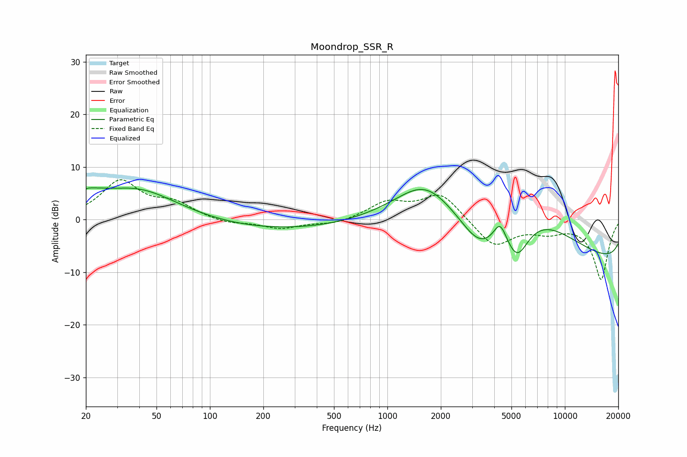

# Moondrop_SSR_R
See [usage instructions](https://github.com/jaakkopasanen/AutoEq#usage) for more options and info.

### Parametric EQs
Apply preamp of -6.1 dB when using parametric equalizer.

|   # | Type    |   Fc (Hz) |    Q |   Gain (dB) |
|-----|---------|-----------|------|-------------|
|   1 | Peaking |        20 | 5.06 |         0.9 |
|   2 | Peaking |        22 | 1.79 |         1.8 |
|   3 | Peaking |        39 | 0.61 |         5.9 |
|   4 | Peaking |       472 | 0.18 |        -2.5 |
|   5 | Peaking |      1628 | 0.84 |         6.9 |
|   6 | Peaking |      3321 | 1.07 |        -8.4 |
|   7 | Peaking |      4314 | 3.93 |         3.8 |
|   8 | Peaking |      5381 | 1.86 |        -8.4 |
|   9 | Peaking |      5746 | 0.29 |        18.8 |
|  10 | Peaking |     10000 | 0.18 |       -16.3 |

### Fixed Band EQs
When using fixed band (also called graphic) equalizer, apply preamp of **-7.7 dB** (if available) and set gains manually with these parameters.

|   # | Type    |   Fc (Hz) |    Q |   Gain (dB) |
|-----|---------|-----------|------|-------------|
|   1 | Peaking |        31 | 1.41 |         7.1 |
|   2 | Peaking |        62 | 1.41 |         2.7 |
|   3 | Peaking |       125 | 1.41 |        -0.8 |
|   4 | Peaking |       250 | 1.41 |        -1.7 |
|   5 | Peaking |       500 | 1.41 |        -0.9 |
|   6 | Peaking |      1000 | 1.41 |         3.1 |
|   7 | Peaking |      2000 | 1.41 |         5   |
|   8 | Peaking |      4000 | 1.41 |        -5.2 |
|   9 | Peaking |      8000 | 1.41 |        -1.9 |
|  10 | Peaking |     16000 | 1.41 |       -11.3 |

### Graphs

