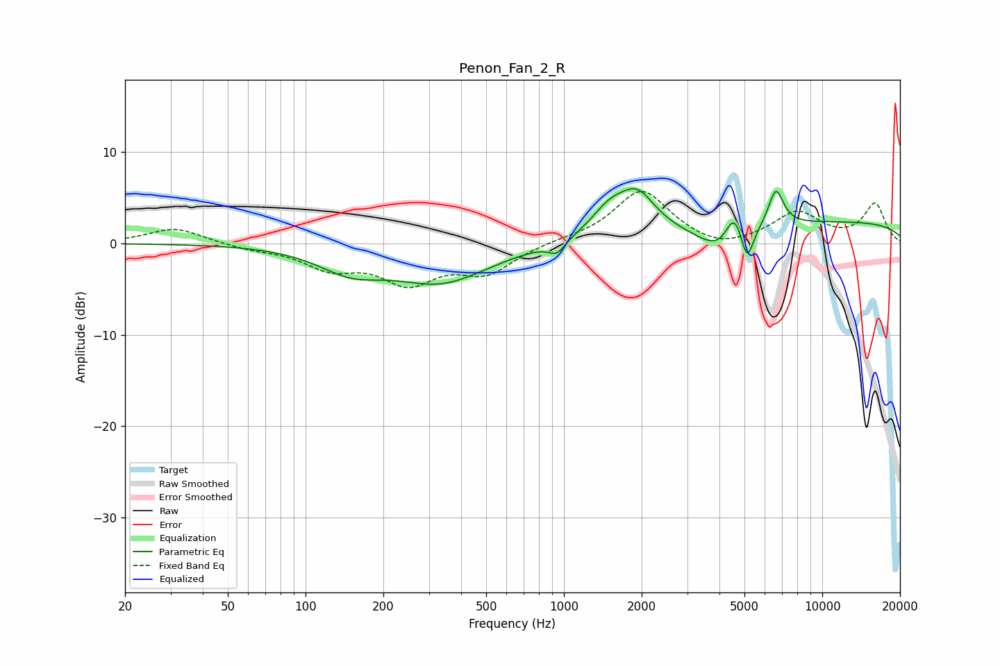

# Penon_Fan_2_R
See [usage instructions](https://github.com/jaakkopasanen/AutoEq#usage) for more options and info.

### Parametric EQs
Apply preamp of -6.1 dB when using parametric equalizer.

|   # | Type    |   Fc (Hz) |    Q |   Gain (dB) |
|-----|---------|-----------|------|-------------|
|   1 | Peaking |       149 | 1.11 |        -2.4 |
|   2 | Peaking |       336 | 0.76 |        -4   |
|   3 | Peaking |       939 | 4.46 |        -1.3 |
|   4 | Peaking |      1499 | 1.95 |         2.7 |
|   5 | Peaking |      1927 | 2.02 |         4.1 |
|   6 | Peaking |      4140 | 1.58 |        -3.4 |
|   7 | Peaking |      4567 | 3.91 |         3.9 |
|   8 | Peaking |      5117 | 5.79 |        -3.7 |
|   9 | Peaking |      6617 | 4.57 |         4.1 |
|  10 | Peaking |     10000 | 0.18 |         2.4 |

### Fixed Band EQs
When using fixed band (also called graphic) equalizer, apply preamp of **-5.8 dB** (if available) and set gains manually with these parameters.

|   # | Type    |   Fc (Hz) |    Q |   Gain (dB) |
|-----|---------|-----------|------|-------------|
|   1 | Peaking |        31 | 1.41 |         1.7 |
|   2 | Peaking |        62 | 1.41 |        -0.5 |
|   3 | Peaking |       125 | 1.41 |        -2.4 |
|   4 | Peaking |       250 | 1.41 |        -3.9 |
|   5 | Peaking |       500 | 1.41 |        -3   |
|   6 | Peaking |      1000 | 1.41 |         0.3 |
|   7 | Peaking |      2000 | 1.41 |         5.8 |
|   8 | Peaking |      4000 | 1.41 |        -1   |
|   9 | Peaking |      8000 | 1.41 |         3.3 |
|  10 | Peaking |     16000 | 1.41 |         4.3 |

### Graphs

