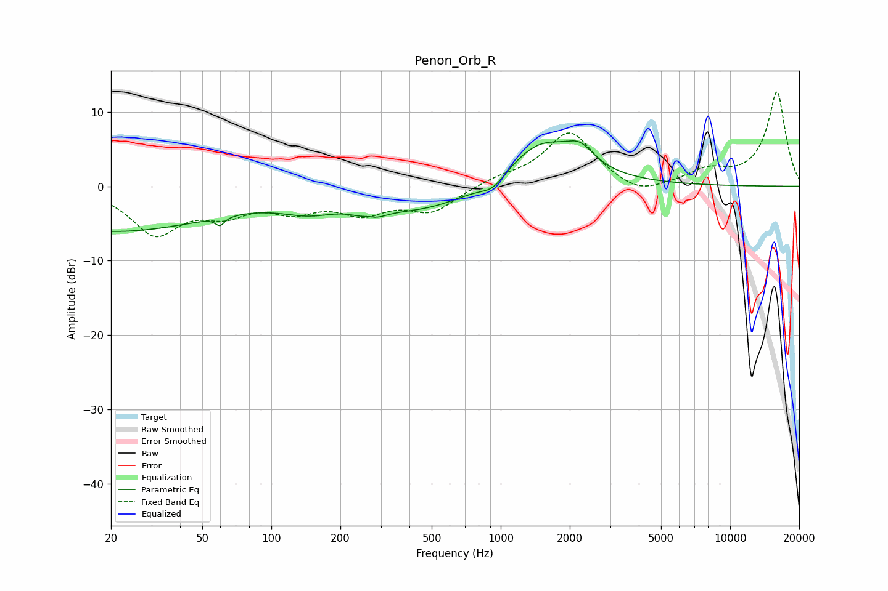

# Penon_Orb_R
See [usage instructions](https://github.com/jaakkopasanen/AutoEq#usage) for more options and info.

### Parametric EQs
Apply preamp of -6.2 dB when using parametric equalizer.

|   # | Type    |   Fc (Hz) |    Q |   Gain (dB) |
|-----|---------|-----------|------|-------------|
|   1 | Peaking |        20 | 0.3  |        -6   |
|   2 | Peaking |        60 | 5.58 |         3.4 |
|   3 | Peaking |        60 | 6    |        -4.5 |
|   4 | Peaking |       146 | 1.12 |        -2   |
|   5 | Peaking |       266 | 3.52 |         3   |
|   6 | Peaking |       267 | 2.87 |        -4.2 |
|   7 | Peaking |       468 | 0.6  |        -3.2 |
|   8 | Peaking |       927 | 2.55 |        -1.7 |
|   9 | Peaking |      1504 | 0.89 |         6.3 |
|  10 | Peaking |      2223 | 2.46 |         2.3 |

### Fixed Band EQs
When using fixed band (also called graphic) equalizer, apply preamp of **-12.8 dB** (if available) and set gains manually with these parameters.

|   # | Type    |   Fc (Hz) |    Q |   Gain (dB) |
|-----|---------|-----------|------|-------------|
|   1 | Peaking |        31 | 1.41 |        -6.1 |
|   2 | Peaking |        62 | 1.41 |        -2.9 |
|   3 | Peaking |       125 | 1.41 |        -2.7 |
|   4 | Peaking |       250 | 1.41 |        -3.1 |
|   5 | Peaking |       500 | 1.41 |        -3.2 |
|   6 | Peaking |      1000 | 1.41 |         0.9 |
|   7 | Peaking |      2000 | 1.41 |         7.3 |
|   8 | Peaking |      4000 | 1.41 |        -1.7 |
|   9 | Peaking |      8000 | 1.41 |         1.9 |
|  10 | Peaking |     16000 | 1.41 |        12.7 |

### Graphs

