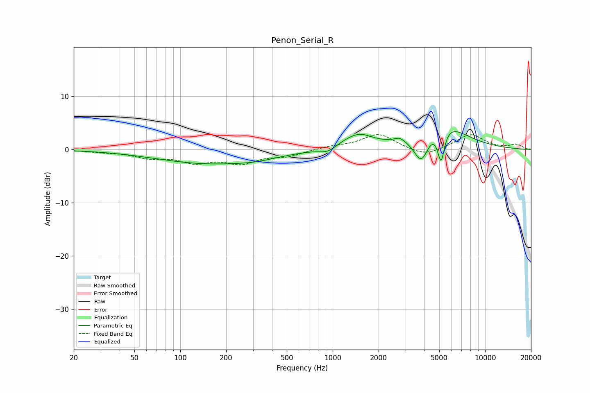

# Penon_Serial_R
See [usage instructions](https://github.com/jaakkopasanen/AutoEq#usage) for more options and info.

### Parametric EQs
Apply preamp of -3.5 dB when using parametric equalizer.

|   # | Type    |   Fc (Hz) |    Q |   Gain (dB) |
|-----|---------|-----------|------|-------------|
|   1 | Peaking |       158 | 0.39 |        -2.6 |
|   2 | Peaking |       316 | 1.14 |        -0.4 |
|   3 | Peaking |       933 | 2.4  |        -1.2 |
|   4 | Peaking |      1394 | 1.19 |         2.3 |
|   5 | Peaking |      1536 | 2.42 |         0.6 |
|   6 | Peaking |      2754 | 4.17 |         0.8 |
|   7 | Peaking |      3818 | 2.79 |        -5.7 |
|   8 | Peaking |      4455 | 6    |         0.1 |
|   9 | Peaking |      5092 | 0.95 |         5.6 |
|  10 | Peaking |      5140 | 6    |        -6.4 |

### Fixed Band EQs
When using fixed band (also called graphic) equalizer, apply preamp of **-2.9 dB** (if available) and set gains manually with these parameters.

|   # | Type    |   Fc (Hz) |    Q |   Gain (dB) |
|-----|---------|-----------|------|-------------|
|   1 | Peaking |        31 | 1.41 |        -0.3 |
|   2 | Peaking |        62 | 1.41 |        -1.3 |
|   3 | Peaking |       125 | 1.41 |        -2.1 |
|   4 | Peaking |       250 | 1.41 |        -2.3 |
|   5 | Peaking |       500 | 1.41 |        -1.1 |
|   6 | Peaking |      1000 | 1.41 |         0.5 |
|   7 | Peaking |      2000 | 1.41 |         2.9 |
|   8 | Peaking |      4000 | 1.41 |        -1.4 |
|   9 | Peaking |      8000 | 1.41 |         2.8 |
|  10 | Peaking |     16000 | 1.41 |         0.9 |

### Graphs

