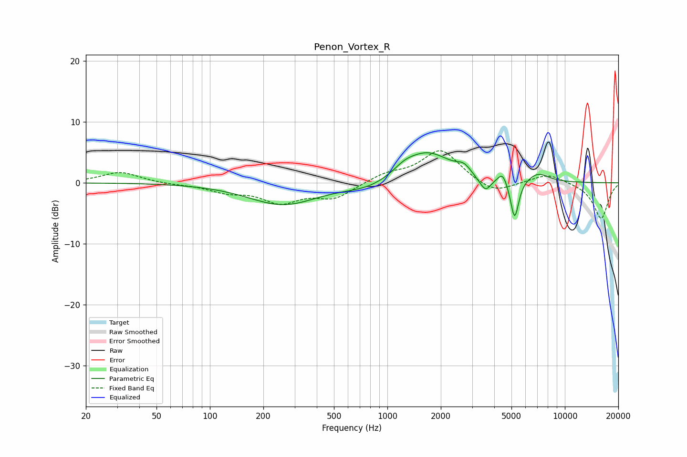

# Penon_Vortex_R
See [usage instructions](https://github.com/jaakkopasanen/AutoEq#usage) for more options and info.

### Parametric EQs
Apply preamp of -5.0 dB when using parametric equalizer.

|   # | Type    |   Fc (Hz) |    Q |   Gain (dB) |
|-----|---------|-----------|------|-------------|
|   1 | Peaking |       258 | 0.73 |        -3.6 |
|   2 | Peaking |       794 | 1.09 |        -1.2 |
|   3 | Peaking |      1248 | 2.45 |         0.9 |
|   4 | Peaking |      1674 | 1.02 |         5   |
|   5 | Peaking |      2702 | 3.58 |         1.3 |
|   6 | Peaking |      3386 | 3.1  |        -0.8 |
|   7 | Peaking |      3587 | 4.98 |        -1.8 |
|   8 | Peaking |      4458 | 5.57 |         1.8 |
|   9 | Peaking |      5211 | 6    |        -6.6 |
|  10 | Peaking |      7045 | 2.2  |         1.5 |

### Fixed Band EQs
When using fixed band (also called graphic) equalizer, apply preamp of **-5.3 dB** (if available) and set gains manually with these parameters.

|   # | Type    |   Fc (Hz) |    Q |   Gain (dB) |
|-----|---------|-----------|------|-------------|
|   1 | Peaking |        31 | 1.41 |         1.8 |
|   2 | Peaking |        62 | 1.41 |        -0.2 |
|   3 | Peaking |       125 | 1.41 |        -1.3 |
|   4 | Peaking |       250 | 1.41 |        -3   |
|   5 | Peaking |       500 | 1.41 |        -2.4 |
|   6 | Peaking |      1000 | 1.41 |         1.3 |
|   7 | Peaking |      2000 | 1.41 |         5.4 |
|   8 | Peaking |      4000 | 1.41 |        -2   |
|   9 | Peaking |      8000 | 1.41 |         1.5 |
|  10 | Peaking |     16000 | 1.41 |        -5.9 |

### Graphs

