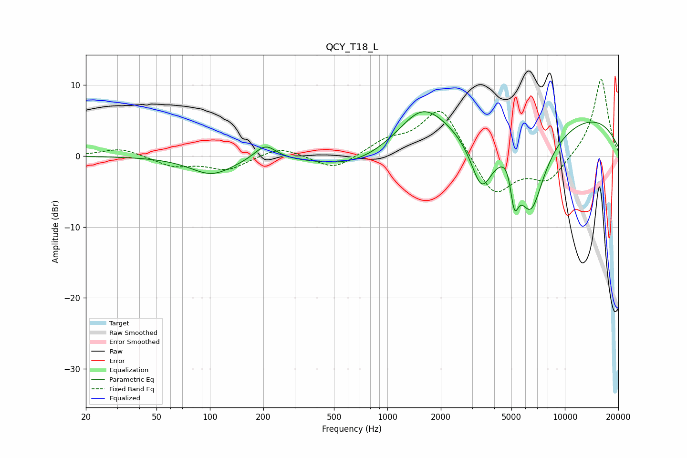

# QCY_T18_L
See [usage instructions](https://github.com/jaakkopasanen/AutoEq#usage) for more options and info.

### Parametric EQs
Apply preamp of -6.3 dB when using parametric equalizer.

|   # | Type    |   Fc (Hz) |    Q |   Gain (dB) |
|-----|---------|-----------|------|-------------|
|   1 | Peaking |       102 | 1.17 |        -2.5 |
|   2 | Peaking |       205 | 2.32 |         2.2 |
|   3 | Peaking |       696 | 0.62 |        -2.6 |
|   4 | Peaking |      1567 | 1.12 |         4.5 |
|   5 | Peaking |      3387 | 2.25 |        -7.2 |
|   6 | Peaking |      4883 | 3.19 |         3   |
|   7 | Peaking |      5181 | 5.4  |        -6.7 |
|   8 | Peaking |      5399 | 0.36 |        -4.3 |
|   9 | Peaking |      6422 | 1.66 |       -11.4 |
|  10 | Peaking |      6679 | 0.18 |         8.9 |

### Fixed Band EQs
When using fixed band (also called graphic) equalizer, apply preamp of **-10.9 dB** (if available) and set gains manually with these parameters.

|   # | Type    |   Fc (Hz) |    Q |   Gain (dB) |
|-----|---------|-----------|------|-------------|
|   1 | Peaking |        31 | 1.41 |         1.2 |
|   2 | Peaking |        62 | 1.41 |        -1.4 |
|   3 | Peaking |       125 | 1.41 |        -1.9 |
|   4 | Peaking |       250 | 1.41 |         1.4 |
|   5 | Peaking |       500 | 1.41 |        -2.1 |
|   6 | Peaking |      1000 | 1.41 |         1.9 |
|   7 | Peaking |      2000 | 1.41 |         7.1 |
|   8 | Peaking |      4000 | 1.41 |        -5.9 |
|   9 | Peaking |      8000 | 1.41 |        -3.4 |
|  10 | Peaking |     16000 | 1.41 |        11.1 |

### Graphs

