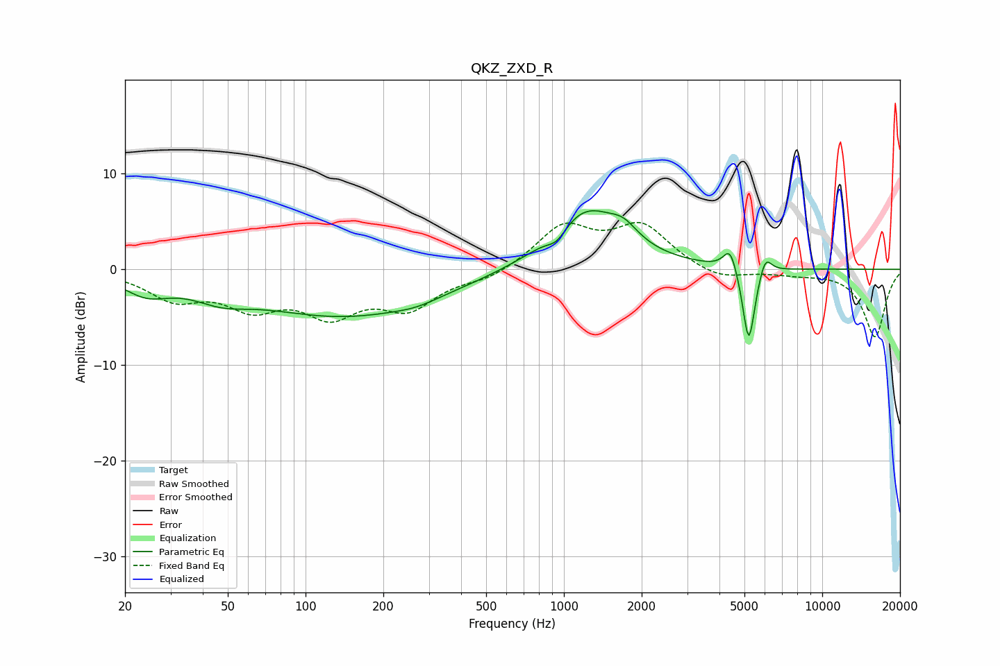

# QKZ_ZXD_R
See [usage instructions](https://github.com/jaakkopasanen/AutoEq#usage) for more options and info.

### Parametric EQs
Apply preamp of -6.2 dB when using parametric equalizer.

|   # | Type    |   Fc (Hz) |    Q |   Gain (dB) |
|-----|---------|-----------|------|-------------|
|   1 | Peaking |        24 | 1.63 |        -1.9 |
|   2 | Peaking |        47 | 1.33 |        -1.4 |
|   3 | Peaking |       143 | 0.39 |        -4.8 |
|   4 | Peaking |       268 | 1.69 |        -0.5 |
|   5 | Peaking |       940 | 3.68 |        -1.3 |
|   6 | Peaking |      1210 | 1.02 |         6.4 |
|   7 | Peaking |      1706 | 2.63 |         1.5 |
|   8 | Peaking |      4403 | 5.37 |         2.5 |
|   9 | Peaking |      5196 | 5.85 |        -8.3 |
|  10 | Peaking |      6020 | 5.86 |         2.1 |

### Fixed Band EQs
When using fixed band (also called graphic) equalizer, apply preamp of **-5.0 dB** (if available) and set gains manually with these parameters.

|   # | Type    |   Fc (Hz) |    Q |   Gain (dB) |
|-----|---------|-----------|------|-------------|
|   1 | Peaking |        31 | 1.41 |        -2.8 |
|   2 | Peaking |        62 | 1.41 |        -3.4 |
|   3 | Peaking |       125 | 1.41 |        -4.1 |
|   4 | Peaking |       250 | 1.41 |        -3.7 |
|   5 | Peaking |       500 | 1.41 |        -1   |
|   6 | Peaking |      1000 | 1.41 |         4.4 |
|   7 | Peaking |      2000 | 1.41 |         4.4 |
|   8 | Peaking |      4000 | 1.41 |        -1.2 |
|   9 | Peaking |      8000 | 1.41 |        -0.4 |
|  10 | Peaking |     16000 | 1.41 |        -7.1 |

### Graphs

