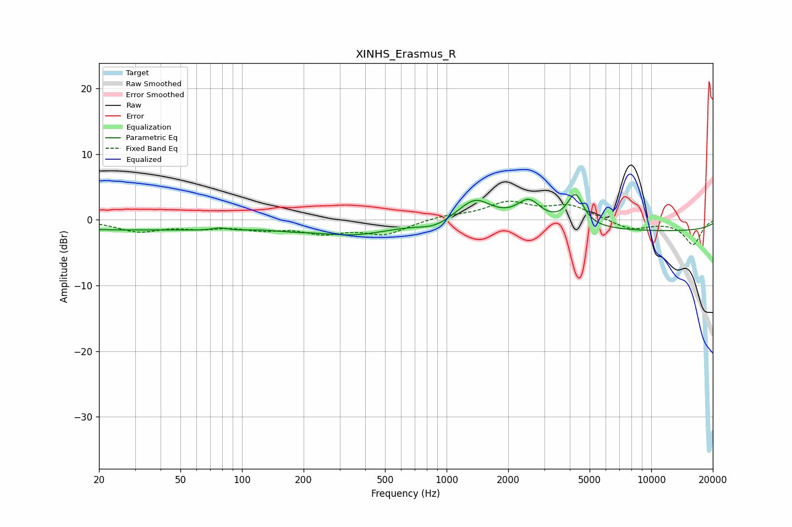

# XINHS_Erasmus_R
See [usage instructions](https://github.com/jaakkopasanen/AutoEq#usage) for more options and info.

### Parametric EQs
Apply preamp of -3.9 dB when using parametric equalizer.

|   # | Type    |   Fc (Hz) |    Q |   Gain (dB) |
|-----|---------|-----------|------|-------------|
|   1 | Peaking |        28 | 0.19 |        -1.5 |
|   2 | Peaking |        78 | 3.14 |         1   |
|   3 | Peaking |        79 | 2.23 |        -0.8 |
|   4 | Peaking |       176 | 1.54 |        -0.4 |
|   5 | Peaking |       354 | 0.75 |        -2   |
|   6 | Peaking |       874 | 1.85 |        -1   |
|   7 | Peaking |      1376 | 1.7  |         3.6 |
|   8 | Peaking |      2524 | 2.41 |         3.4 |
|   9 | Peaking |      4258 | 3.56 |         4.8 |
|  10 | Peaking |     10000 | 0.18 |        -1.7 |

### Fixed Band EQs
When using fixed band (also called graphic) equalizer, apply preamp of **-2.9 dB** (if available) and set gains manually with these parameters.

|   # | Type    |   Fc (Hz) |    Q |   Gain (dB) |
|-----|---------|-----------|------|-------------|
|   1 | Peaking |        31 | 1.41 |        -1.7 |
|   2 | Peaking |        62 | 1.41 |        -0.9 |
|   3 | Peaking |       125 | 1.41 |        -1.2 |
|   4 | Peaking |       250 | 1.41 |        -1.7 |
|   5 | Peaking |       500 | 1.41 |        -2.1 |
|   6 | Peaking |      1000 | 1.41 |         0.6 |
|   7 | Peaking |      2000 | 1.41 |         2.5 |
|   8 | Peaking |      4000 | 1.41 |         2.1 |
|   9 | Peaking |      8000 | 1.41 |        -1.5 |
|  10 | Peaking |     16000 | 1.41 |        -3.7 |

### Graphs

