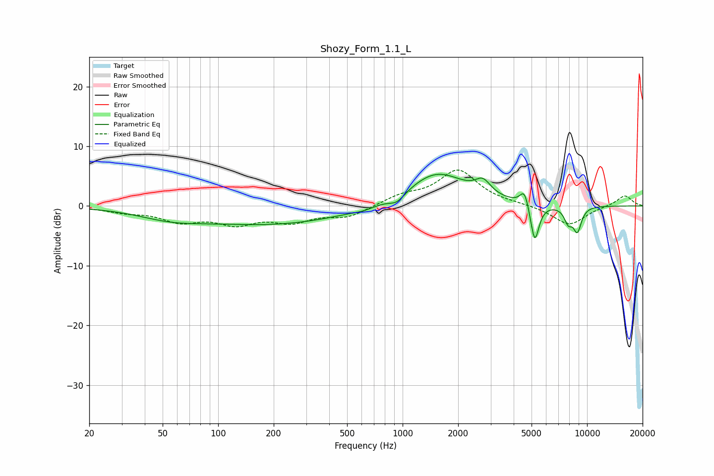

# Shozy_Form_1.1_L
See [usage instructions](https://github.com/jaakkopasanen/AutoEq#usage) for more options and info.

### Parametric EQs
Apply preamp of -5.4 dB when using parametric equalizer.

|   # | Type    |   Fc (Hz) |    Q |   Gain (dB) |
|-----|---------|-----------|------|-------------|
|   1 | Peaking |        55 | 0.83 |        -1.4 |
|   2 | Peaking |       197 | 0.34 |        -3   |
|   3 | Peaking |       614 | 2.57 |        -0.4 |
|   4 | Peaking |       932 | 3.33 |        -1.4 |
|   5 | Peaking |      1528 | 0.89 |         5.7 |
|   6 | Peaking |      2728 | 3.43 |         2.3 |
|   7 | Peaking |      4580 | 6    |         2.8 |
|   8 | Peaking |      5203 | 5.98 |        -6.6 |
|   9 | Peaking |      7905 | 6    |        -2.4 |
|  10 | Peaking |      8854 | 5.62 |        -4   |

### Fixed Band EQs
When using fixed band (also called graphic) equalizer, apply preamp of **-6.1 dB** (if available) and set gains manually with these parameters.

|   # | Type    |   Fc (Hz) |    Q |   Gain (dB) |
|-----|---------|-----------|------|-------------|
|   1 | Peaking |        31 | 1.41 |        -0.8 |
|   2 | Peaking |        62 | 1.41 |        -2.3 |
|   3 | Peaking |       125 | 1.41 |        -2.6 |
|   4 | Peaking |       250 | 1.41 |        -2.3 |
|   5 | Peaking |       500 | 1.41 |        -1.8 |
|   6 | Peaking |      1000 | 1.41 |         1.5 |
|   7 | Peaking |      2000 | 1.41 |         5.9 |
|   8 | Peaking |      4000 | 1.41 |         0.2 |
|   9 | Peaking |      8000 | 1.41 |        -3.3 |
|  10 | Peaking |     16000 | 1.41 |         1.8 |

### Graphs

