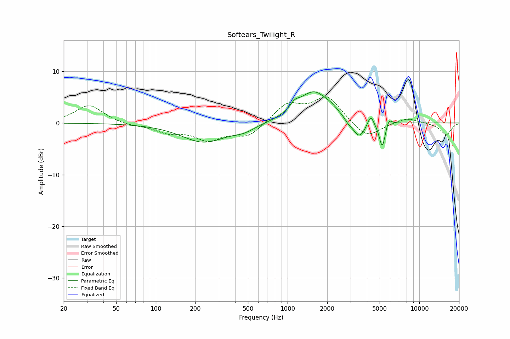

# Softears_Twilight_R
See [usage instructions](https://github.com/jaakkopasanen/AutoEq#usage) for more options and info.

### Parametric EQs
Apply preamp of -6.1 dB when using parametric equalizer.

|   # | Type    |   Fc (Hz) |    Q |   Gain (dB) |
|-----|---------|-----------|------|-------------|
|   1 | Peaking |       231 | 0.83 |        -3.7 |
|   2 | Peaking |       467 | 1.71 |        -1   |
|   3 | Peaking |      1131 | 3.88 |         1.3 |
|   4 | Peaking |      1582 | 1.2  |         6.1 |
|   5 | Peaking |      2161 | 3.12 |         0.6 |
|   6 | Peaking |      2890 | 5.34 |        -0.6 |
|   7 | Peaking |      3489 | 2.89 |        -3.5 |
|   8 | Peaking |      4270 | 6    |         2.2 |
|   9 | Peaking |      5235 | 6    |        -5   |
|  10 | Peaking |      5860 | 6    |         1.5 |

### Fixed Band EQs
When using fixed band (also called graphic) equalizer, apply preamp of **-5.2 dB** (if available) and set gains manually with these parameters.

|   # | Type    |   Fc (Hz) |    Q |   Gain (dB) |
|-----|---------|-----------|------|-------------|
|   1 | Peaking |        31 | 1.41 |         3.5 |
|   2 | Peaking |        62 | 1.41 |        -0.5 |
|   3 | Peaking |       125 | 1.41 |        -1.6 |
|   4 | Peaking |       250 | 1.41 |        -3   |
|   5 | Peaking |       500 | 1.41 |        -2.6 |
|   6 | Peaking |      1000 | 1.41 |         3.6 |
|   7 | Peaking |      2000 | 1.41 |         5   |
|   8 | Peaking |      4000 | 1.41 |        -3.2 |
|   9 | Peaking |      8000 | 1.41 |         1.1 |
|  10 | Peaking |     16000 | 1.41 |        -2.3 |

### Graphs

