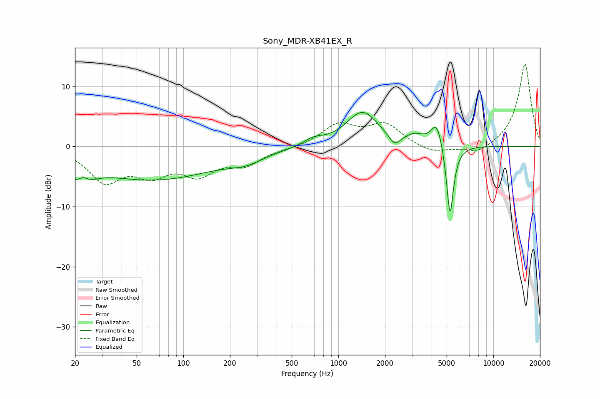

# Sony_MDR-XB41EX_R
See [usage instructions](https://github.com/jaakkopasanen/AutoEq#usage) for more options and info.

### Parametric EQs
Apply preamp of -5.7 dB when using parametric equalizer.

|   # | Type    |   Fc (Hz) |    Q |   Gain (dB) |
|-----|---------|-----------|------|-------------|
|   1 | Peaking |        22 | 2.24 |        -5.4 |
|   2 | Peaking |        22 | 3.71 |         3.2 |
|   3 | Peaking |        64 | 0.34 |        -5.4 |
|   4 | Peaking |       255 | 1.28 |        -1.3 |
|   5 | Peaking |       691 | 2.22 |         1.1 |
|   6 | Peaking |      1431 | 1.35 |         5.7 |
|   7 | Peaking |      2306 | 3.75 |        -1.9 |
|   8 | Peaking |      3101 | 2.32 |         1.4 |
|   9 | Peaking |      4329 | 3.78 |         4.3 |
|  10 | Peaking |      5255 | 6    |       -12.6 |

### Fixed Band EQs
When using fixed band (also called graphic) equalizer, apply preamp of **-13.8 dB** (if available) and set gains manually with these parameters.

|   # | Type    |   Fc (Hz) |    Q |   Gain (dB) |
|-----|---------|-----------|------|-------------|
|   1 | Peaking |        31 | 1.41 |        -5.4 |
|   2 | Peaking |        62 | 1.41 |        -3.9 |
|   3 | Peaking |       125 | 1.41 |        -4   |
|   4 | Peaking |       250 | 1.41 |        -2.7 |
|   5 | Peaking |       500 | 1.41 |        -0.3 |
|   6 | Peaking |      1000 | 1.41 |         3.5 |
|   7 | Peaking |      2000 | 1.41 |         3.5 |
|   8 | Peaking |      4000 | 1.41 |        -1.3 |
|   9 | Peaking |      8000 | 1.41 |        -1.5 |
|  10 | Peaking |     16000 | 1.41 |        13.9 |

### Graphs

