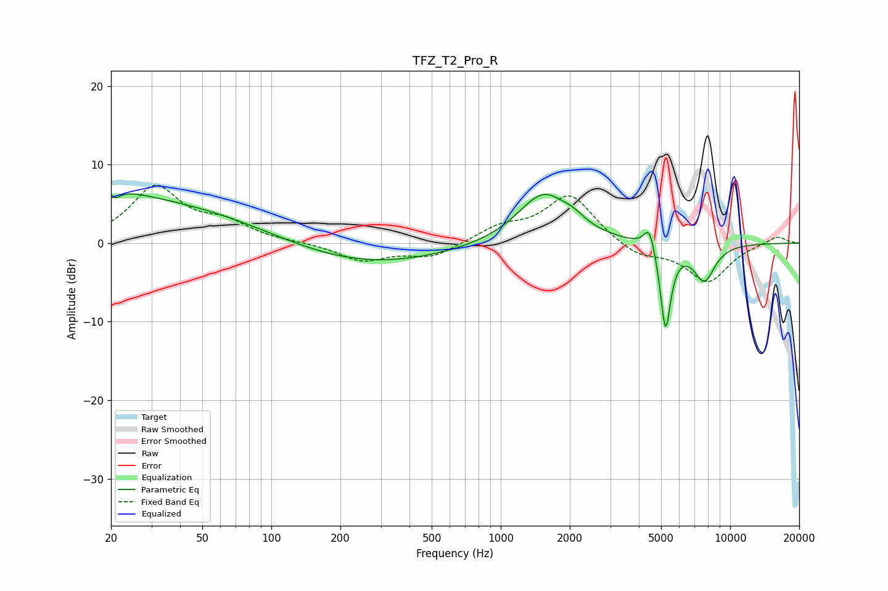

# TFZ_T2_Pro_R
See [usage instructions](https://github.com/jaakkopasanen/AutoEq#usage) for more options and info.

### Parametric EQs
Apply preamp of -6.4 dB when using parametric equalizer.

|   # | Type    |   Fc (Hz) |    Q |   Gain (dB) |
|-----|---------|-----------|------|-------------|
|   1 | Peaking |        20 | 0.92 |         1.7 |
|   2 | Peaking |        20 | 5.9  |         3.2 |
|   3 | Peaking |        20 | 5.94 |        -3.7 |
|   4 | Peaking |        31 | 0.24 |         5.3 |
|   5 | Peaking |       218 | 0.36 |        -3.3 |
|   6 | Peaking |      1533 | 1.25 |         6.4 |
|   7 | Peaking |      2077 | 2.85 |         0.9 |
|   8 | Peaking |      4452 | 5.73 |         3.2 |
|   9 | Peaking |      5229 | 6    |       -11.1 |
|  10 | Peaking |      7716 | 2.84 |        -4.6 |

### Fixed Band EQs
When using fixed band (also called graphic) equalizer, apply preamp of **-7.5 dB** (if available) and set gains manually with these parameters.

|   # | Type    |   Fc (Hz) |    Q |   Gain (dB) |
|-----|---------|-----------|------|-------------|
|   1 | Peaking |        31 | 1.41 |         7   |
|   2 | Peaking |        62 | 1.41 |         2.2 |
|   3 | Peaking |       125 | 1.41 |         0.1 |
|   4 | Peaking |       250 | 1.41 |        -2.2 |
|   5 | Peaking |       500 | 1.41 |        -1.8 |
|   6 | Peaking |      1000 | 1.41 |         1.8 |
|   7 | Peaking |      2000 | 1.41 |         6.2 |
|   8 | Peaking |      4000 | 1.41 |        -1.7 |
|   9 | Peaking |      8000 | 1.41 |        -4.9 |
|  10 | Peaking |     16000 | 1.41 |         1   |

### Graphs

