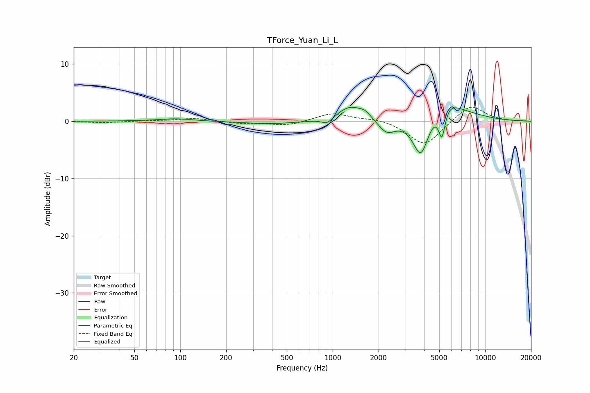

# TForce_Yuan_Li_L
See [usage instructions](https://github.com/jaakkopasanen/AutoEq#usage) for more options and info.

### Parametric EQs
Apply preamp of -2.5 dB when using parametric equalizer.

|   # | Type    |   Fc (Hz) |    Q |   Gain (dB) |
|-----|---------|-----------|------|-------------|
|   1 | Peaking |        93 | 1.27 |         0.5 |
|   2 | Peaking |       395 | 0.78 |        -0.5 |
|   3 | Peaking |       921 | 3.81 |        -1.1 |
|   4 | Peaking |      1301 | 1.65 |         2.6 |
|   5 | Peaking |      1637 | 3.65 |         0.9 |
|   6 | Peaking |      2260 | 2.56 |        -2.2 |
|   7 | Peaking |      3787 | 2.71 |        -7   |
|   8 | Peaking |      5207 | 6    |        -5.7 |
|   9 | Peaking |      5349 | 1.59 |         4.1 |
|  10 | Peaking |      7539 | 0.91 |         0.9 |

### Fixed Band EQs
When using fixed band (also called graphic) equalizer, apply preamp of **-2.5 dB** (if available) and set gains manually with these parameters.

|   # | Type    |   Fc (Hz) |    Q |   Gain (dB) |
|-----|---------|-----------|------|-------------|
|   1 | Peaking |        31 | 1.41 |        -0.3 |
|   2 | Peaking |        62 | 1.41 |         0.1 |
|   3 | Peaking |       125 | 1.41 |         0.5 |
|   4 | Peaking |       250 | 1.41 |        -0.4 |
|   5 | Peaking |       500 | 1.41 |        -0.8 |
|   6 | Peaking |      1000 | 1.41 |         1.5 |
|   7 | Peaking |      2000 | 1.41 |         0.5 |
|   8 | Peaking |      4000 | 1.41 |        -4.4 |
|   9 | Peaking |      8000 | 1.41 |         3   |
|  10 | Peaking |     16000 | 1.41 |         0   |

### Graphs

