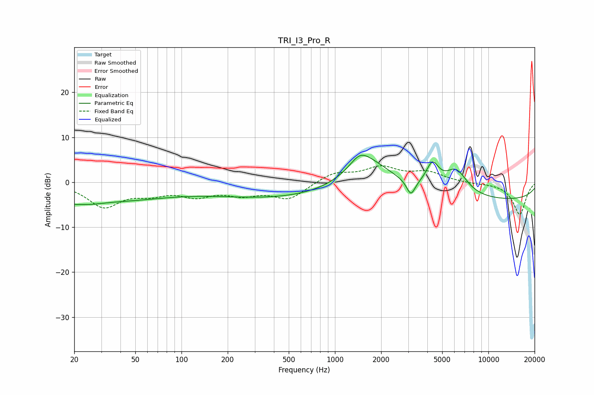

# TRI_I3_Pro_R
See [usage instructions](https://github.com/jaakkopasanen/AutoEq#usage) for more options and info.

### Parametric EQs
Apply preamp of -6.1 dB when using parametric equalizer.

|   # | Type    |   Fc (Hz) |    Q |   Gain (dB) |
|-----|---------|-----------|------|-------------|
|   1 | Peaking |        20 | 5.6  |        -0.6 |
|   2 | Peaking |        23 | 1.25 |        -1.7 |
|   3 | Peaking |        38 | 0.4  |        -3.5 |
|   4 | Peaking |       623 | 0.23 |        -3.9 |
|   5 | Peaking |      1453 | 2.13 |         3.1 |
|   6 | Peaking |      1699 | 0.77 |         7.6 |
|   7 | Peaking |      3124 | 5.14 |        -3.4 |
|   8 | Peaking |      4321 | 3.3  |         5.3 |
|   9 | Peaking |      6154 | 1.85 |         5.6 |
|  10 | Peaking |     10000 | 0.18 |        -4   |

### Fixed Band EQs
When using fixed band (also called graphic) equalizer, apply preamp of **-3.8 dB** (if available) and set gains manually with these parameters.

|   # | Type    |   Fc (Hz) |    Q |   Gain (dB) |
|-----|---------|-----------|------|-------------|
|   1 | Peaking |        31 | 1.41 |        -5.2 |
|   2 | Peaking |        62 | 1.41 |        -2   |
|   3 | Peaking |       125 | 1.41 |        -2.6 |
|   4 | Peaking |       250 | 1.41 |        -2.3 |
|   5 | Peaking |       500 | 1.41 |        -3.6 |
|   6 | Peaking |      1000 | 1.41 |         2.1 |
|   7 | Peaking |      2000 | 1.41 |         3.1 |
|   8 | Peaking |      4000 | 1.41 |         2.1 |
|   9 | Peaking |      8000 | 1.41 |        -0.3 |
|  10 | Peaking |     16000 | 1.41 |        -7.2 |

### Graphs

