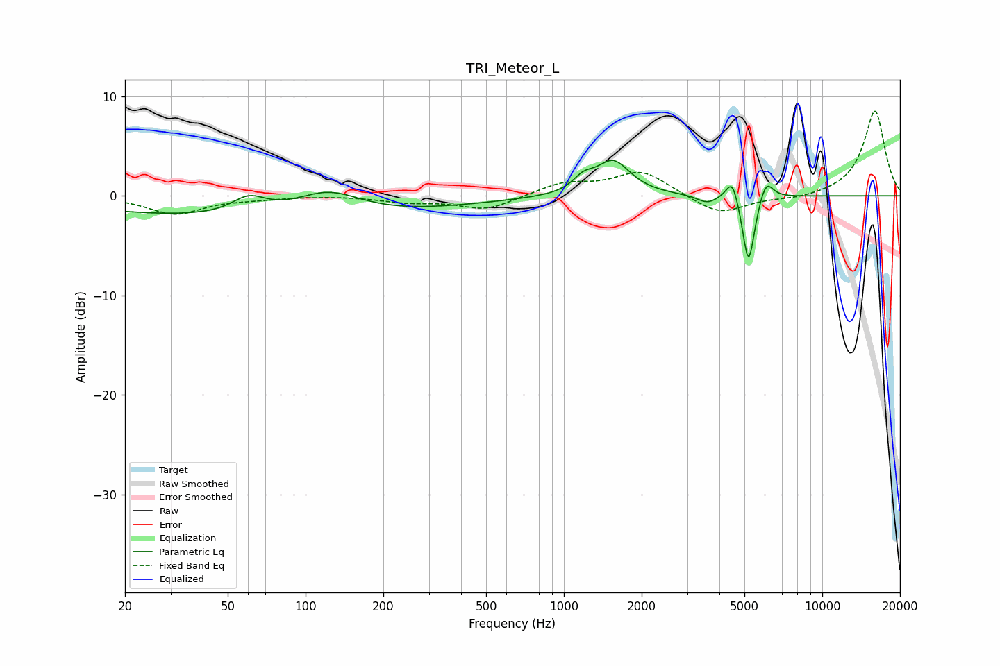

# TRI_Meteor_L
See [usage instructions](https://github.com/jaakkopasanen/AutoEq#usage) for more options and info.

### Parametric EQs
Apply preamp of -3.7 dB when using parametric equalizer.

|   # | Type    |   Fc (Hz) |    Q |   Gain (dB) |
|-----|---------|-----------|------|-------------|
|   1 | Peaking |        60 | 2.18 |         1.7 |
|   2 | Peaking |        72 | 0.18 |        -2.3 |
|   3 | Peaking |       123 | 1.12 |         2.4 |
|   4 | Peaking |      1188 | 3.62 |         1.2 |
|   5 | Peaking |      1550 | 2.13 |         3.4 |
|   6 | Peaking |      3590 | 3.55 |        -0.8 |
|   7 | Peaking |      4330 | 2.71 |         0.1 |
|   8 | Peaking |      4488 | 5.95 |         2.4 |
|   9 | Peaking |      5185 | 6    |        -7.2 |
|  10 | Peaking |      6066 | 5.25 |         2.1 |

### Fixed Band EQs
When using fixed band (also called graphic) equalizer, apply preamp of **-8.6 dB** (if available) and set gains manually with these parameters.

|   # | Type    |   Fc (Hz) |    Q |   Gain (dB) |
|-----|---------|-----------|------|-------------|
|   1 | Peaking |        31 | 1.41 |        -1.8 |
|   2 | Peaking |        62 | 1.41 |        -0.2 |
|   3 | Peaking |       125 | 1.41 |         0.1 |
|   4 | Peaking |       250 | 1.41 |        -0.6 |
|   5 | Peaking |       500 | 1.41 |        -1.4 |
|   6 | Peaking |      1000 | 1.41 |         1.2 |
|   7 | Peaking |      2000 | 1.41 |         2.5 |
|   8 | Peaking |      4000 | 1.41 |        -2   |
|   9 | Peaking |      8000 | 1.41 |        -0.3 |
|  10 | Peaking |     16000 | 1.41 |         8.6 |

### Graphs

